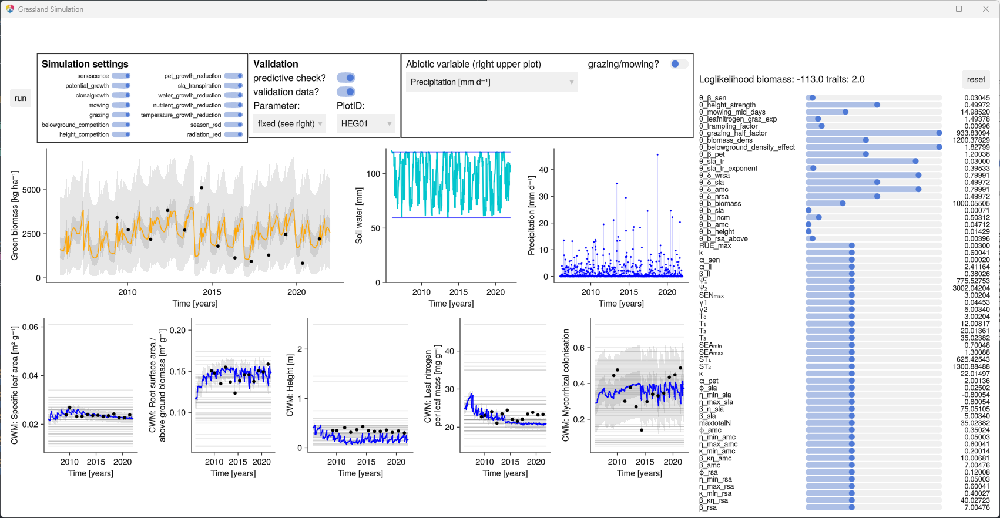

# GrasslandTraitSim.jl
[![][docs-dev-img]][docs-dev-url]  

[docs-dev-img]: https://img.shields.io/badge/docs-dev-blue.svg
[docs-dev-url]: https://felixnoessler.github.io/GrasslandTraitSim.jl/dev/

[ECEM 2023 slides](assets/ECEM_2023_presentation.pdf)

