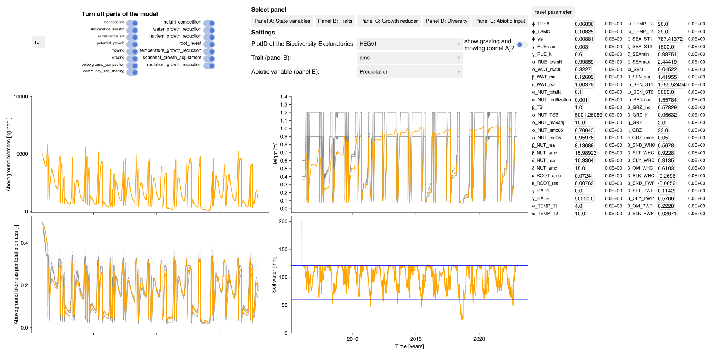

# Dashboard {#Dashboard}

The dashboard can be used to graphically check the calibration results. It shows the simulated total biomass, soil water content and the simulated community weighted mean traits for all grassland plots of the Biodiversity Exploratories.

`GLMakie.jl` is used instead of `CairoMakie.jl` to take advantage of interactive features and must be loaded explicitly. What can be done:
- see simulation results for different grassland plots with the `plotID` (per default for three sites of the Biodiversity Exploratories, see [tutorial how to use your input](/tutorials/how_to_prepare_input#How-to-prepare-the-input-data-to-start-a-simulation)) 
  
- manually change each parameter value
  
- disable individual model components
  
- view different abiotic inputs (e.g. precipitation, air temperature)
  
- show the timing of the grazing and mowing in the biomass plot
  
- in all plots it is possible to zoom
  

```julia
import GrasslandTraitSim as sim
using GLMakie
GLMakie.activate!()

# load own data with:
# sim.load_data("your_data_path_here") 

sim.dashboard()

# note: if you want to switch back to CairoMakie
# using CairoMakie; CairoMakie.activate!()
```

<details>
<summary>Code for generating static image for documentation</summary>


```julia
import GrasslandTraitSim as sim
using GLMakie
GLMakie.activate!()

sim.dashboard(; variable_p = sim.load_optim_result(), path = "dashboard.png")
```

</details>




