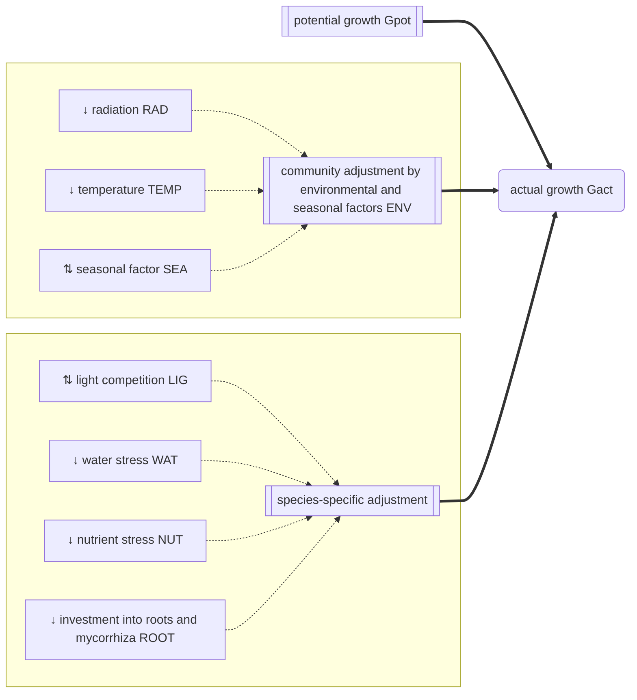

# Growth {#Growth}

Click on a process to view detailed documentation:




The actual growth $G_{act, ts}$ [kg ha⁻¹] is derived from the community potential growth $G_{pot, t}$ [kg ha⁻¹] and the multiplicative effect of five growth adjustment factors:

$$G_{act, ts} = G_{pot, t} \cdot LIG_{ts} \cdot NUT_{ts} \cdot WAT_{ts} \cdot ROOT_{ts} \cdot ENV_{t}$$

where $LIG_{ts}$ [-] is the species-specific competition for light, $NUT_{ts}$ [-] is the species-specific competition for nutrients, $WAT_{ts}$ [-] is the species-specific competition for soil water, $ROOT_{ts}$ [-] is the species-specific cost for maintaining roots and mycorrhiza, and $ENV_{t}$ [-] is the non-species specific adjustment based on environmental and seasonal factors.

## API {#API}
<details class='jldocstring custom-block' open>
<summary><a id='GrasslandTraitSim.growth!' href='#GrasslandTraitSim.growth!'><span class="jlbinding">GrasslandTraitSim.growth!</span></a> <Badge type="info" class="jlObjectType jlFunction" text="Function" /></summary>


```julia
growth!(
;
    t,
    container,
    above_biomass,
    total_biomass,
    actual_height,
    W,
    nutrients,
    WHC,
    PWP
)

```


Calculates the growth of the plant species.


<Badge type="info" class="source-link" text="source"><a href="https://github.com/FelixNoessler/GrasslandTraitSim.jl/blob/8fcf43661af2b44d618f4d4a9ad9c58c594c000a/src/3_biomass/1_growth/1_growth.jl#L8" target="_blank" rel="noreferrer">source</a></Badge>

</details>

