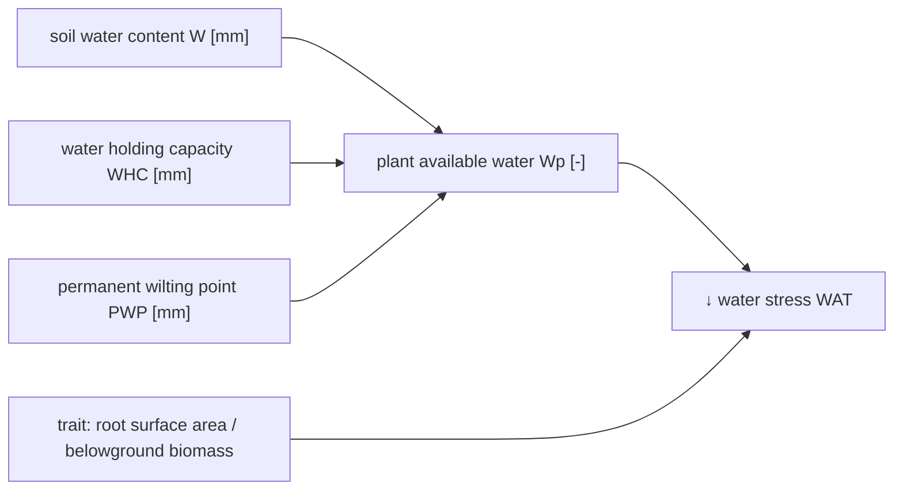

# Species-specific growth adjustment - Soil water {#Species-specific-growth-adjustment-Soil-water}
<script setup>
    import { onMounted } from 'vue';
    import { plantAvailableWaterPlot, waterStressPlot } from './d3_plots/WaterStress.js';
    onMounted(() => { plantAvailableWaterPlot(); waterStressPlot(); });
</script>





The water stress growth reducer $WAT_{ts}$ [-] is defined as:

$$\begin{align}
    WAT_{ts} &= 
        \begin{cases}
            0 & \text{if } W_{p, t} = 0 \\
            1 / \left(1 + \exp\left(-\beta_{W,RSA}\cdot \left(W_{p, t} - x_{0, W,RSA} \right)\right)\right) & \text{if } 0 < W_{p, t} < 1 \\
            1 & \text{if } W_{p, t} >= 1 \\
        \end{cases} \\
    x_{0, W,RSA} &= \frac{1}{\beta_{W,RSA}} \cdot \left(-\delta_{W,RSA}\cdot \left(TRSA_{ts} - \left(\frac{1}{\delta_{W,RSA}} \cdot \log\left(\frac{1 - \alpha_{W,RSA, 05}}{\alpha_{W,RSA,05}}\right) + \phi_{RSA}\right)\right)\right) + 0.5  \\
    TRSA_{ts} &= \frac{B_{B, ts}}{B_{ts}} \cdot  rsa_s  \\
    W_{p, t} &= \frac{W_{t} - PWP}{WHC-PWP}  
\end{align}$$

:::tabs

== Parameter
- $\phi_{RSA}$ reference trait value [m² g⁻¹]
  
- $\beta_{W,RSA}$ slope of response function [-]
  
- $\alpha_{W,RSA,05}$ response at $W_{p, t} = 0.5$ for species with the reference trait value[-]
  
- $\delta_{W,RSA}$ scales the difference in the growth reducer between species [g m⁻²]
  

== Variables

state variables:
- $B_{B, ts}$ belowground biomass of each species [kg ha⁻¹]
  
- $B_{ts}$ biomass of each species [kg ha⁻¹]
  
- $W_{t}$ soil water content in the rooting zone [mm]
  

intermediate variables:
- $WHC$ water holding capacity [mm]
  
- $PWP$ permanent wilting point [mm]
  
- $TRSA_{ts}$ root surface area per total biomass of each species [m² g⁻¹] 
  
- $W_{p, t} \in [0, 1]$ plant available water [-]
  

morphological traits:
- $rsa_s$ root surface area per belowground biomass of each species [m² g⁻¹]
  

:::

## Visualization {#Visualization}
- scaling of the soil water content in the rooting zone by permanent wilting point and water holding capacity
  
<table>
    <colgroup>
        <col>
        <col width="80px">
        <col>
    </colgroup>
    <tbody>
    <tr>
        <td>permanent wilting point (PWP)</td>
        <td><span id="PWP-value"></span></td>
        <td><input type="range" min="25" max="105" step="1" value="50" id="PWP" class="plant_av_water_input"></td>
    </tr>
    <tr>
        <td>water holding capacity (WHC)</td>
        <td><span id="WHC-value"></span></td>
        <td><input type="range" min="85" max="205" step="1" value="120" id="WHC" class="plant_av_water_input"></td>
    </tr>
    </tbody>
</table>
<svg id="plant_av_water_graph"></svg>

- growth reducer
  
<table>
    <colgroup>
        <col>
        <col width="80px">
        <col>
    </colgroup>
    <tbody>
    <tr>
        <td>response at Wₚ = 0.5 for species with the reference trait value (α_WRSA05) <br>(strong to weak growth reduction)</td>
        <td><span id="ɑ_R_05-value"></span></td>
        <td><input type="range" id="ɑ_R_05" min="0.1" max="0.999" step="0.001" value="0.9" class="input_water_stress_graph"></td>
    </tr>
    <tr>
        <td>difference between species (δ_WAT_rsa) <br>(no to strong difference)</td>
        <td><span id="δ_R-value">10</span></td>
        <td><input type="range" id="δ_R" min="0.1" max="25.0" step="0.1" value="10" class="input_water_stress_graph"></td>
    </tr>
    <tr>
        <td>slope of response (β_WAT_rsa)</td>
        <td><span id="β_R-value"></span></td>
        <td><input type="range" id="β_R" min="3" max="10" step="0.1" value="7" class="input_water_stress_graph"></td>
    </tr>
    <tr>
        <td>reference trait value (ϕ_TRSA)</td>
        <td><span id="phi_RSA-value"></span></td>
        <td><input type="range" id="phi_RSA" min="0.05" max="0.25" step="0.05" value="0.15" class="input_water_stress_graph"></td>
    </tr>
    </tbody>
</table>

<svg id="water_stress_graph"></svg>


## API {#API}
<details class='jldocstring custom-block' open>
<summary><a id='GrasslandTraitSim.water_reduction!' href='#GrasslandTraitSim.water_reduction!'><span class="jlbinding">GrasslandTraitSim.water_reduction!</span></a> <Badge type="info" class="jlObjectType jlFunction" text="Function" /></summary>


```julia
water_reduction!(; container, W, PWP, WHC)

```


Reduction of growth based on the plant available water and the root surface area per belowground biomass.


<Badge type="info" class="source-link" text="source"><a href="https://github.com/FelixNoessler/GrasslandTraitSim.jl/blob/8fcf43661af2b44d618f4d4a9ad9c58c594c000a/src/3_biomass/1_growth/5_water_competition.jl#L1" target="_blank" rel="noreferrer">source</a></Badge>

</details>

