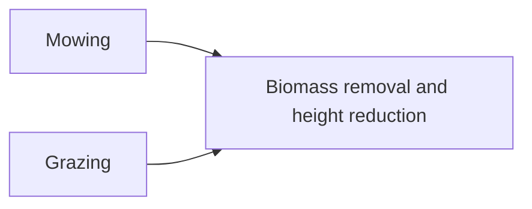

# Mowing and grazing {#Mowing-and-grazing}




Biomass losses due to management $M_{ts}$ [kg ha⁻¹] are caused by mowing $MOW_{ts}$ [kg ha⁻¹] and grazing $GRZ_{ts}$ [kg ha⁻¹]:

$$M_{ts} = MOW_{ts} + GRZ_{ts}$$

## Mowing {#Mowing}

The mown biomass $MOW_{ts}$ [kg ha⁻¹] is decribed by:

$$MOW_{ts} =  \frac{\max\left(H_{ts} - CUT_{t},\,0\right)}{H_{ts}} \cdot B_{A, ts}$$

:::tabs

== Parameter

none

== Variables

inputs:
- $CUT_{t}$ cutting height of a mowing event [m]
  

state variables:
- $B_{A, ts}$ aboveground biomass of each species [kg ha⁻¹]
  
- $H_{ts}$ plant height of each species [m]
  

:::

### API {#API}
<details class='jldocstring custom-block' open>
<summary><a id='GrasslandTraitSim.mowing!' href='#GrasslandTraitSim.mowing!'><span class="jlbinding">GrasslandTraitSim.mowing!</span></a> <Badge type="info" class="jlObjectType jlFunction" text="Function" /></summary>


```julia
mowing!(
;
    container,
    mowing_height,
    above_biomass,
    actual_height
)

```


Simulate the mown biomass of each plant species.


<Badge type="info" class="source-link" text="source"><a href="https://github.com/FelixNoessler/GrasslandTraitSim.jl/blob/8fcf43661af2b44d618f4d4a9ad9c58c594c000a/src/3_biomass/3_management/2_mowing.jl#L1" target="_blank" rel="noreferrer">source</a></Badge>

</details>


## Grazing {#Grazing}

The grazed biomass $GRZ_{ts}$ [kg ha⁻¹] is defined as:

$$\begin{align}
GRZ_{ts} &=
    \frac{\kappa_{GRZ} \cdot LD_{t} \cdot (B_{F, t})^{2}}{(\kappa_{GRZ} \cdot LD_{t} \cdot \eta_{GRZ})^2 + (B_{F, t})^2} \cdot
    \frac{LNC_{GRZ,ts}\cdot H_{GRZ,ts} \cdot B_{F, ts}}{\sum_{i=1}^{S}LNC_{GRZ,ti} \cdot H_{GRZ,ti} \cdot B_{F, ti}  } \\
B_{F, ts} &= \max\left(1 - \frac{\eta_{GRZ,H}}{H_{ts}},\,0\right) \cdot B_{A, ts} \\
B_{F, t} &= \sum_{s=1}^{S} B_{F, ts} \\
LNC_{GRZ,ts} &= \left(\frac{lnc_s}{LNC_{cwm, t}}\right) ^ {\beta_{GRZ,lnc}} \\
LNC_{cwm, t} &= \sum_{s=1}^{S} \frac{B_{F, ts}}{B_{F,t}} \cdot lnc_s \\
H_{GRZ,ts} &= \left(\frac{H_{ts}}{H_{cwm,t}} \right) ^ {\beta_{GRZ,H}} \\
H_{cwm,t} &= \sum_{s=1}^{S} \frac{B_{F, ts}}{B_{F,t}} \cdot H_{ts}
\end{align}$$

The equation is partly based on [Moulin _et al._ (2021)](/references#Moulin2021).

:::tabs

== Parameter
- $\kappa_{GRZ}$ maximum consumption of biomass per livestock and day [kg ha⁻¹]
  
- $\eta_{GRZ}$ controls when the farmer starts to supply additional fooder [-]
  
- $\eta_{GRZ,H}$ plant parts below this height are not accessible to grazers. [m] 
  
- $\beta_{GRZ,lnc}$ scales the influence of the leaf nitrogen content on the preference of the grazers [-]
  
- $\beta_{GRZ,H}$ scales the influence of the height on the preference of the grazers [-]
  

== Variables

inputs:
- $LD_{t}$ livestock density [-]
  

state variables:
- $B_{A, ts}$ aboveground biomass of each species [kg ha⁻¹]
  
- $H_{ts}$ plant height of each species [m]
  

intermediate variables:
- $B_{F, ts}$ biomass that can be fed by grazers of each species [kg ha⁻¹]
  
- $B_{F, t}$ total biomass that can be fed by grazers [kg ha⁻¹]
  
- $LNC_{GRZ,ts}$ scaled influence of leaf nitrogen content (&quot;palatability&quot;) on the gazer preference [-]
  
- $H_{GRZ,ts}$ scaled influence of plant height on the gazer preference [-]
  
- $LNC_{cwm,t}$ community weighted mean leaf nitrogen content [mg g⁻¹]
  
- $H_{cwm,t}$ community weighted mean height [m]
  

morphological traits:
- $lnc_s$ leaf nitrogent content of each species [mg g⁻¹]
  

:::

### Visualization {#Visualization}
- Graphic of the total grazed biomass (first term of the grazing equation)
  
<script setup>
    import { onMounted } from 'vue';
    import { grazingPlot } from './d3_plots/Grazing.js';
    onMounted(() => { grazingPlot() });
</script>

<table>
    <colgroup>
        <col>
        <col width="80px">
        <col>
    </colgroup>
    <tbody>
     <tr>
        <td>Livestock Density (LD)</td>
        <td><span id="LD-value">3</span></td>
        <td><input type="range" min="0.1" max="4.5" step="0.1" value="3" id="LD" class="slider"></td>
    </tr>
    <tr>
        <td>Controls when the farmer starts to supply additional fooder (η_GRZ)</td>
        <td><span id="η_GRZ-value">2</span></td>
        <td><input type="range" min="0.1" max="10" step="0.1" value="2" id="η_GRZ"></td>
    </tr>
    <tr>
        <td>Consumption per livestock and day (κ_GRZ)</td>
        <td><span id="κ-value">22</span></td>
        <td><input type="range" min="12" max="25" step="1" value="22" id="κ"></td>
    </tr>
    </tbody>
</table>
<div style="max-width: 700px"><svg id="grazing_graph"></svg></div>


### API {#API-2}
<details class='jldocstring custom-block' open>
<summary><a id='GrasslandTraitSim.grazing!' href='#GrasslandTraitSim.grazing!'><span class="jlbinding">GrasslandTraitSim.grazing!</span></a> <Badge type="info" class="jlObjectType jlFunction" text="Function" /></summary>


```julia
grazing!(; container, LD, above_biomass, actual_height)

```


Simulates the removal of biomass by grazing and trampling for each species.


<Badge type="info" class="source-link" text="source"><a href="https://github.com/FelixNoessler/GrasslandTraitSim.jl/blob/8fcf43661af2b44d618f4d4a9ad9c58c594c000a/src/3_biomass/3_management/1_grazing.jl#L1" target="_blank" rel="noreferrer">source</a></Badge>

</details>

