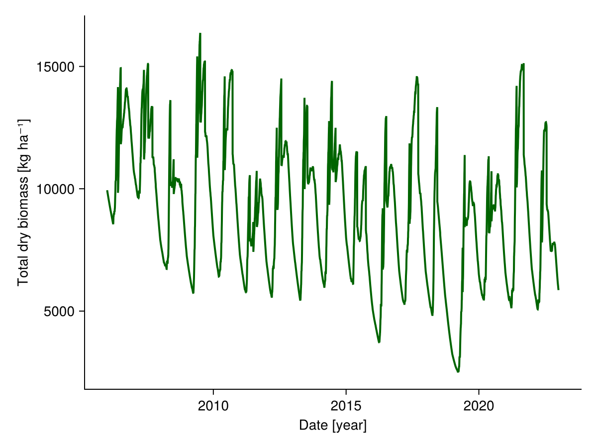
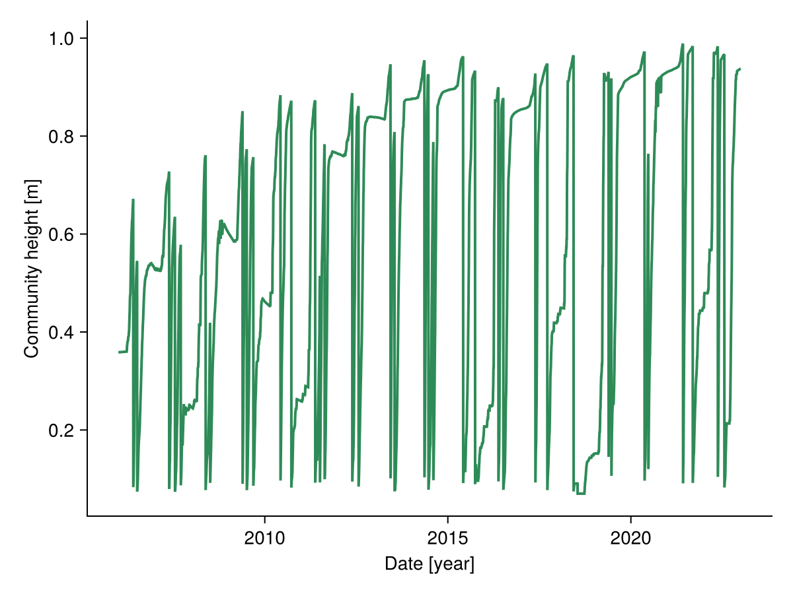
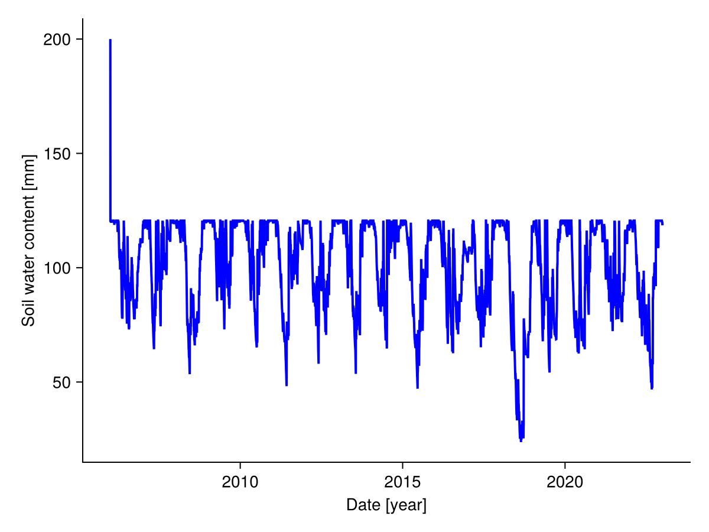
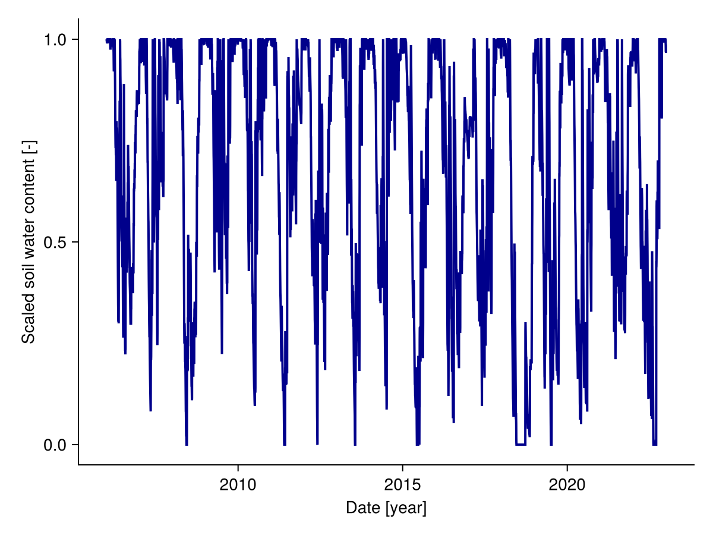
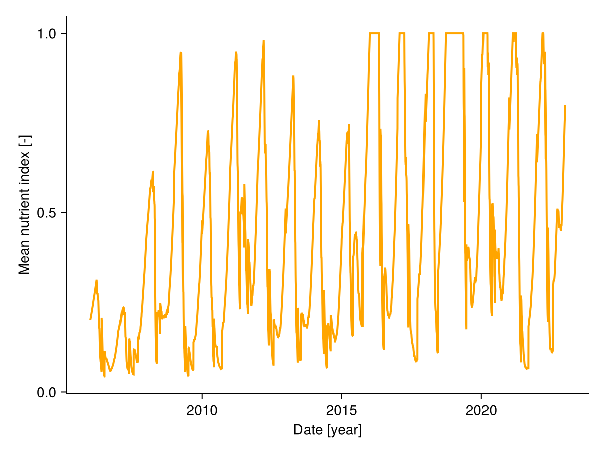
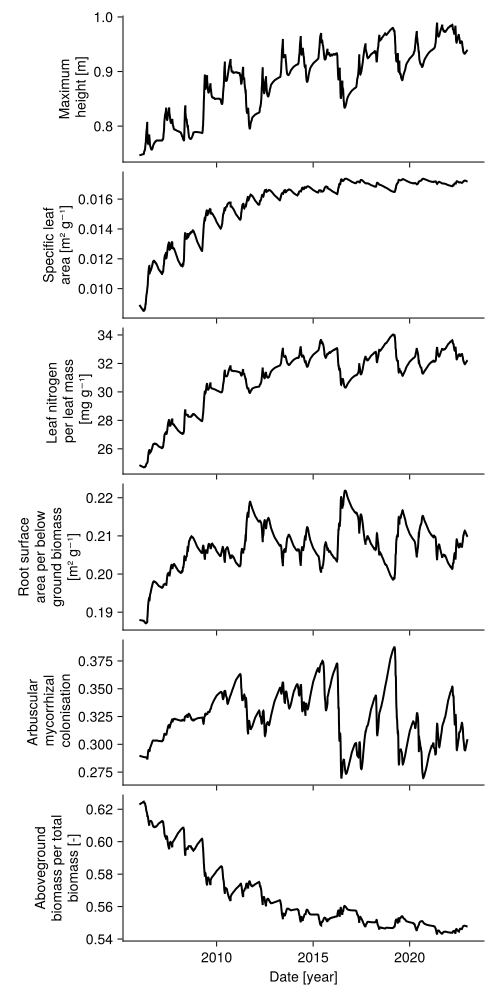

# How to analyse the model output {#How-to-analyse-the-model-output}

I assume that you have read the tutorial on how to prepare the input data and run a simulation (see [here](/tutorials/how_to_prepare_input#How-to-prepare-the-input-data-to-start-a-simulation)). In this tutorial, we will analyse the output of the simulation that is stored in the object `sol`.

```julia
import GrasslandTraitSim as sim

using Statistics
using CairoMakie
using Unitful
using RCall # only for functional diversity indices
CairoMakie.activate!()

input_obj = sim.create_input("HEG01");
p = sim.optim_parameter()
sol = sim.solve_prob(; input_obj, p);
```


## Biomass {#Biomass}

We can look at the simulated biomass:

```julia
sol.output.biomass
```


```ansi
┌ 6210×70 DimArray{Unitful.Quantity{Float64, 𝐌 𝐋^-2, Unitful.FreeUnits{(ha^-1, kg), 𝐌 𝐋^-2, nothing}}, 2} state_biomass ┐
├──────────────────────────────────────────────────────────────────────── dims ┤
  ↓ time Sampled{Dates.Date} Dates.Date("2006-01-01"):Dates.Day(1):Dates.Date("2023-01-01") ForwardOrdered Regular Points,
  → species Sampled{Int64} 1:70 ForwardOrdered Regular Points
└──────────────────────────────────────────────────────────────────────────────┘
 ↓ →                    1                   …    70
  2006-01-01  142.0 kg ha^-1            142.0 kg ha^-1
  2006-01-02  141.824 kg ha^-1          141.544 kg ha^-1
  2006-01-03  141.648 kg ha^-1          141.09 kg ha^-1
  2006-01-04  141.472 kg ha^-1          140.637 kg ha^-1
 ⋮                                          ⋱     ⋮
  2022-12-29    0.0190621 kg ha^-1     2033.69 kg ha^-1
  2022-12-30    0.0190254 kg ha^-1     2026.86 kg ha^-1
  2022-12-31    0.0189888 kg ha^-1     2018.75 kg ha^-1
  2023-01-01    0.0189522 kg ha^-1  …  2011.25 kg ha^-1
```


The four dimension of the array are: daily time step, patch x dim, patch y dim, and species.  For plotting the values with `Makie.jl`, we have to remove the units with `ustrip`:

```julia
total_biomass = vec(sum(sol.output.biomass; dims = :species))

fig, _ = lines(sol.simp.output_date_num, ustrip.(total_biomass), color = :darkgreen, linewidth = 2;
      axis = (; ylabel = "Total dry biomass [kg ha⁻¹]",
                xlabel = "Date [year]"))
fig
```

{width=600px height=450px}

## Height of the community {#Height-of-the-community}

We can also look at the simulated height of each species:

```julia
sol.output.height
```


```ansi
┌ 6210×70 DimArray{Unitful.Quantity{Float64, 𝐋, Unitful.FreeUnits{(m,), 𝐋, nothing}}, 2} state_height ┐
├──────────────────────────────────────────────────────────────────────── dims ┤
  ↓ time Sampled{Dates.Date} Dates.Date("2006-01-01"):Dates.Day(1):Dates.Date("2023-01-01") ForwardOrdered Regular Points,
  → species Sampled{Int64} 1:70 ForwardOrdered Regular Points
└──────────────────────────────────────────────────────────────────────────────┘
 ↓ →                  1           …  67      68      69           70
  2006-01-01  0.4 m           0.4 m   0.2 m   0.3 m        0.6 m
  2006-01-02  0.4 m           0.4 m   0.2 m   0.3 m        0.6 m
  2006-01-03  0.4 m           0.4 m   0.2 m   0.3 m        0.6 m
  2006-01-04  0.4 m           0.4 m   0.2 m   0.3 m        0.6 m
 ⋮                                ⋱                                ⋮
  2022-12-29  0.299069 m      0.8 m   0.5 m   0.118124 m   1.2 m
  2022-12-30  0.300345 m      0.8 m   0.5 m   0.118257 m   1.2 m
  2022-12-31  0.301125 m      0.8 m   0.5 m   0.118338 m   1.2 m
  2023-01-01  0.302132 m  …   0.8 m   0.5 m   0.118443 m   1.2 m
```


We calculate the height of the community by weighting the height of the species by their proportion of biomass on the total biomass:

```julia
total_biomass = vec(sum(sol.output.biomass; dims = :species))
community_height = vec(sum(sol.output.height .* sol.output.biomass ./ total_biomass; dims = :species))

fig, _ = lines(sol.simp.output_date_num, ustrip.(community_height),
                color = :seagreen, linewidth = 2;
    axis = (; ylabel = "Community height [m]",
                xlabel = "Date [year]"))
fig
```

{width=600px height=450px}

## Share of each species {#Share-of-each-species}

We can look at the share of each species over time:
<details><summary>show code</summary>


```julia
# colors are assigned according to the specific leaf area (SLA)
color = ustrip.(sol.traits.sla)
colormap = :viridis
colorrange = (minimum(color), maximum(color))
is = sortperm(color)
cmap = cgrad(colormap)
colors = [cmap[(co .- colorrange[1]) ./ (colorrange[2] - colorrange[1])]
          for co in color[is]]

# calculate biomass proportion of each species
biomass_ordered = sol.output.biomass[:, sortperm(color)]
biomass_fraction = biomass_ordered ./ sum(biomass_ordered; dims = :species)
biomass_cumfraction = cumsum(biomass_fraction; dims = 2)

begin
    fig = Figure()
    Axis(fig[1,1]; ylabel = "Relative proportion of biomass of the species",
         xlabel = "Date [year]",
         limits = (sol.simp.output_date_num[1], sol.simp.output_date_num[end], 0, 1))

    for i in 1:sol.simp.nspecies
        ylower = nothing
        if i == 1
            ylower = zeros(size(biomass_cumfraction, 1))
        else
            ylower = biomass_cumfraction[:, i-1]
        end
        yupper = biomass_cumfraction[:, i]

        band!(sol.simp.output_date_num, vec(ylower), vec(yupper);
              color = colors[i])
    end

    Colorbar(fig[1,2]; limits = colorrange, colormap = cmap,
             label = "Specific leaf area [m² g⁻¹]")

    fig
end
```

</details>


## Soil water content {#Soil-water-content}

Similarly, we plot the soil water content over time:

```julia
fig, _ = lines(sol.simp.output_date_num, vec(ustrip.(sol.output.water)), color = :blue, linewidth = 2;
      axis = (; ylabel = "Soil water content [mm]", xlabel = "Date [year]"))
fig
```

{width=600px height=450px}

Soil water content is used to calculate plant water stress. To calculate water stress, we scale the soil water content by the water holding capacity and the permanent wilting point. The scaled soil water content can be visualised as follows:

```julia
function get_Wsc(x)
    WHC = mean(x.soil_variables.WHC)
    PWP = mean(x.soil_variables.PWP)
    W = vec(x.output.water)
    Wsc = @. (W - PWP) / (WHC - PWP)
    return max.(min.(Wsc, 1.0), 0.0)
end

fig, _ = lines(sol.simp.output_date_num, get_Wsc(sol), color = :darkblue, linewidth = 2;
    axis = (; ylabel = "Scaled soil water content [-]", xlabel = "Date [year]"))
fig
```

{width=600px height=450px}

## Nutrients {#Nutrients}

Soil nutrients are not modelled directly in GrasslandTraitsim.jl. However, the nutrient index changes over time in response to changes in biomass due to increased competition for nutrients and in response to changes in annual inputs, namely fertilisation and total soil nitrogen. The nutrient index is species specific and is higher for species with a very different nutrient uptake strategy (defined by root surface area and arbuscular mycorhizal colonisation rate) compared to species with very high biomass, because species with a very different strategy are less affected by nutrient competition. We can plot the mean nutrient index over time:

```julia
fig, _ = lines(sol.simp.mean_input_date_num, vec(sol.output.mean_nutrient_index), color = :orange, linewidth = 2;
    axis = (; ylabel = "Mean nutrient index [-]", xlabel = "Date [year]"))
fig
```

{width=600px height=450px}

## Community weighted mean traits {#Community-weighted-mean-traits}

We can calculate for all traits the community weighted mean over time:
<details><summary>show code</summary>


```julia
relative_biomass = sol.output.biomass ./ total_biomass
# the species do not have different lbp values, so we not use it here
traits = [:maxheight, :sla, :lnc, :rsa, :amc, :abp]
trait_names = [
    "Maximum\n height [m]", "Specific leaf\narea [m² g⁻¹]", "Leaf nitrogen \nper leaf mass\n [mg g⁻¹]",
    "Root surface\narea per below\nground biomass\n[m² g⁻¹]", "Arbuscular\n mycorrhizal\n colonisation",
    "Aboveground\nbiomass per total\nbiomass [-]"]

begin
    fig = Figure(; size = (500, 1000))

    for i in eachindex(traits)
        trait_vals = sol.traits[traits[i]]
        weighted_trait = trait_vals .* relative_biomass'
        cwm_trait = vec(sum(weighted_trait; dims = 1))

        Axis(fig[i, 1];
                xlabel = i == length(traits) ? "Date [year]" : "",
                xticklabelsvisible = i == length(traits) ? true : false,
                ylabel = trait_names[i])
        lines!(sol.simp.output_date_num, ustrip.(cwm_trait);
                color = :black, linewidth = 2)

    end

    [rowgap!(fig.layout, i, 5) for i in 1:length(traits)-1]

    fig
end
```

</details>





## Grazed and mown biomass {#Grazed-and-mown-biomass}

We can look at the grazed and mown biomass over time:
<details><summary>show code</summary>


```julia
# total
sum(sol.output.mown)
sum(sol.output.grazed)

# plot the grazed and mown biomass over time
grazed_site = dropdims(mean(sol.output.grazed; dims=(:species)); dims=(:species))
cum_grazed = cumsum(grazed_site)

mown_site = dropdims(mean(sol.output.mown; dims=(:species)); dims=(:species))
cum_mown = cumsum(mown_site)
begin
      fig = Figure()
      Axis(fig[1,1]; ylabel = "Cummulative grazed\nbiomass [kg ha⁻¹]")
      lines!(sol.simp.mean_input_date_num, ustrip.(vec(cum_grazed)), color = :black, linewidth = 2;)
      Axis(fig[2,1]; ylabel = "Cummulative mown\nbiomass [kg ha⁻¹]", xlabel = "Date [year]")
      lines!(sol.simp.mean_input_date_num, ustrip.(vec(cum_mown)), color = :black, linewidth = 2;)
      fig
end
```

</details>


## Functional diversity indices {#Functional-diversity-indices}

We use the R-package `fundiversity` to compute the functional diversity indices. We run the R-code from Julia using the Julia package `RCall.jl`. We assume that species are present if their biomass is larger than 1 kg/ha.
<details><summary>show code</summary>


```julia
################ Calculate functional diversity in R
function traits_to_matrix(trait_data; std_traits = true)
    trait_names = keys(trait_data)
    ntraits = length(trait_names)
    nspecies = length(trait_data[trait_names[1]])
    m = Matrix{Float64}(undef, nspecies, ntraits)

    for i in eachindex(trait_names)
        tdat = trait_data[trait_names[i]]
        if std_traits
            m[:, i] = (tdat .- mean(tdat)) ./ std(tdat)
        else
            m[:, i] = ustrip.(tdat)
        end
    end

    return m
end

trait_input_wo_lbp = Base.structdiff(sol.traits, (; lbp = nothing))

tstep = 100
biomass = sol.output.biomass[1:tstep:end, :]
biomass[biomass .< 1.0u"kg / ha"] .= 0.0u"kg / ha"
biomass_R = ustrip.(biomass.data)
traits_R = traits_to_matrix(trait_input_wo_lbp;)
site_names = string.("time_", 1:size(biomass_R, 1))
species_names = string.("species_", 1:size(biomass_R, 2))

## transfer data to R
@rput species_names site_names traits_R biomass_R

R"""
library(fundiversity)

rownames(traits_R) <- species_names
rownames(biomass_R) <- site_names
colnames(biomass_R) <- species_names

fric_std_R <- fd_fric(traits_R, biomass_R, stand = TRUE)$FRic
fdis_R <- fd_fdis(traits_R, biomass_R)$FDis
fdiv_R <- fd_fdiv(traits_R, biomass_R)$FDiv
feve_R <- fd_feve(traits_R, biomass_R)$FEve
"""

## get results back from R
@rget fric_std_R fdis_R fdiv_R feve_R

begin
    fig = Figure(size = (900, 1200))

    Axis(fig[1, 1]; ylabel = "Number of species", xticks = 2006:2:2022,
         xticklabelsvisible = false, limits = (nothing, nothing, 0, nothing))
    nspecies = sum(biomass .> 0.0u"kg / ha"; dims = :species)
    lines!(sol.simp.output_date_num[1:tstep:end], vec(nspecies);)

    Axis(fig[2, 1]; yscale = identity, xticks = 2006:2:2022, xticklabelsvisible = false,
         ylabel = "Functional richness -\nfraction of possible volume\nto actual trait volume")
    lines!(sol.simp.output_date_num[1:tstep:end], fric_std_R)

    Axis(fig[3, 1]; xticks = 2006:2:2022, xticklabelsvisible = false,
         ylabel = "Functional dispersion -\nweighted distance to\ncommunity weighted mean")
    lines!(sol.simp.output_date_num[1:tstep:end], fdis_R)

    Axis(fig[4, 1]; xticks = 2006:2:2022, xticklabelsvisible = false,
        ylabel = "Functional divergence -\nweighted distance to\ncenter of convex hull")
    lines!(sol.simp.output_date_num[1:tstep:end], fdiv_R)

    Axis(fig[5, 1]; xticks = 2006:2:2022, xticklabelsvisible = true,
        ylabel = "Functional evenness -\n regularity of species on\nminimum spanning tree,\nweighted by abundance")
    lines!(sol.simp.output_date_num[1:tstep:end], feve_R)

    fig
end
```

</details>


## Shannon and Simpson diversity {#Shannon-and-Simpson-diversity}

We can calculate the Shannon and Simpson diversity over time:
<details><summary>show code</summary>


```julia
tend = size(sol.output.biomass, 1)
shannon = Array{Float64}(undef, tend)
simpson = Array{Float64}(undef, tend)
for t in 1:tend
    b1 = sol.output.biomass[t, :]
    b1 = b1[.!iszero.(b1)]
    p1 = b1 ./ sum(b1)
    shannon[t] = -sum(p1 .* log.(p1))
    simpson[t] = 1 - sum(p1 .^ 2)
end

begin
    fig = Figure()
    Axis(fig[1,1]; ylabel = "Shannon index")
    lines!(sol.simp.output_date_num, shannon, color = :black, linewidth = 2;)
    Axis(fig[2,1]; ylabel = "Simpson index", xlabel = "Date [year]")
    lines!(sol.simp.output_date_num, simpson, color = :black, linewidth = 2;)
    fig
end
```

</details>


