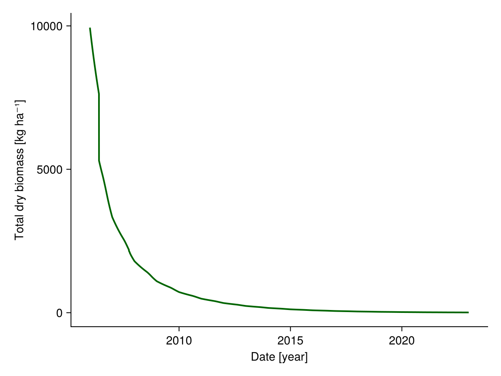

# How to turn-off subprocesses of the model {#How-to-turn-off-subprocesses-of-the-model}

Mainly for debugging purposes, it is possible to turn off subprocesses of the model. This can be useful to understand the effect of a single subprocess on the model output. 

Load packages:

```julia
import GrasslandTraitSim as sim
using CairoMakie
using Unitful
using Statistics
```


All the subprocesses that can be turned off are listed here:

```julia
sim.create_included()
```


```ansi
(senescence = true, senescence_season = true, senescence_sla = true, potential_growth = true, mowing = true, grazing = true, belowground_competition = true, community_self_shading = true, height_competition = true, water_growth_reduction = true, nutrient_growth_reduction = true, root_invest = true, temperature_growth_reduction = true, seasonal_growth_adjustment = true, radiation_growth_reduction = true)
```


We have to write all the processes that we want to turn off in the `included` named tuple. By default, all other processes are included. Here we want to exclude the potential growth of the species. The named tuple looks as follows:

```julia
included = (;
    potential_growth = false,
)

input_obj = sim.create_input("HEG01"; included);
p = sim.optim_parameter();
```


Run the simulation and let&#39;s visualize the biomass dynamic without potential growth:

```julia
sol = sim.solve_prob(; input_obj, p);

total_biomass = vec(sum(sol.output.biomass; dims = :species))

fig, _ = lines(sol.simp.output_date_num, ustrip.(total_biomass), color = :darkgreen, linewidth = 2;
      axis = (; ylabel = "Total dry biomass [kg ha⁻¹]",
                xlabel = "Date [year]"))
fig
```

{width=600px height=450px}
