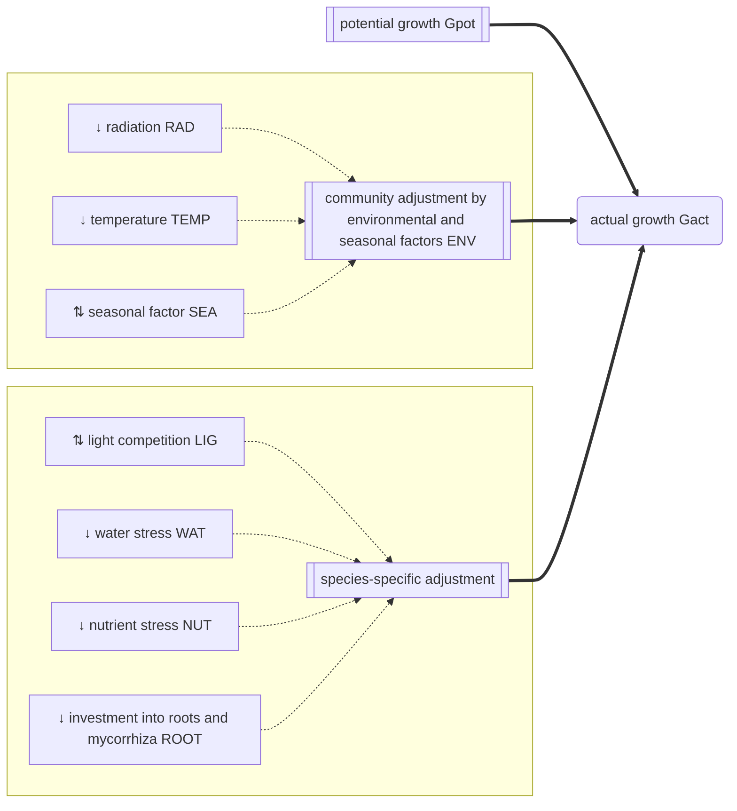

# Growth

Click on a process to view detailed documentation:




The actual growth $G_{act, txys}$ [kg ha⁻¹] is derived from the community potential growth $G_{pot, txy}$ [kg ha⁻¹] and the multiplicative effect of five growth adjustment factors:

$$G_{act, txys} = G_{pot, txy} \cdot LIG_{txys} \cdot NUT_{txys} \cdot WAT_{txys} \cdot ROOT_{txys} \cdot ENV_{txy}$$

where $LIG_{txys}$ [-] is the species-specific competition for light, $NUT_{txys}$ [-] is the species-specific competition for nutrients, $WAT_{txys}$ [-] is the species-specific competition for soil water, $ROOT_{txys}$ [-] is the species-specific cost for maintaining roots and mycorrhiza, and $ENV_{txy}$ [-] is the non-species specific adjustment based on environmental and seasonal factors.

## API
<details class='jldocstring custom-block' open>
<summary><a id='GrasslandTraitSim.growth!' href='#GrasslandTraitSim.growth!'><span class="jlbinding">GrasslandTraitSim.growth!</span></a> <Badge type="info" class="jlObjectType jlFunction" text="Function" /></summary>


```julia
growth!(
;
    t,
    x,
    y,
    container,
    above_biomass,
    total_biomass,
    actual_height,
    W,
    nutrients,
    WHC,
    PWP
)

```


Calculates the growth of the plant species.


[source](https://github.com/FelixNoessler/GrasslandTraitSim.jl/blob/083386dc75748e31525cf4ea66f74778601f0f0c/src/3_biomass/1_growth/1_growth.jl#L8)

</details>

