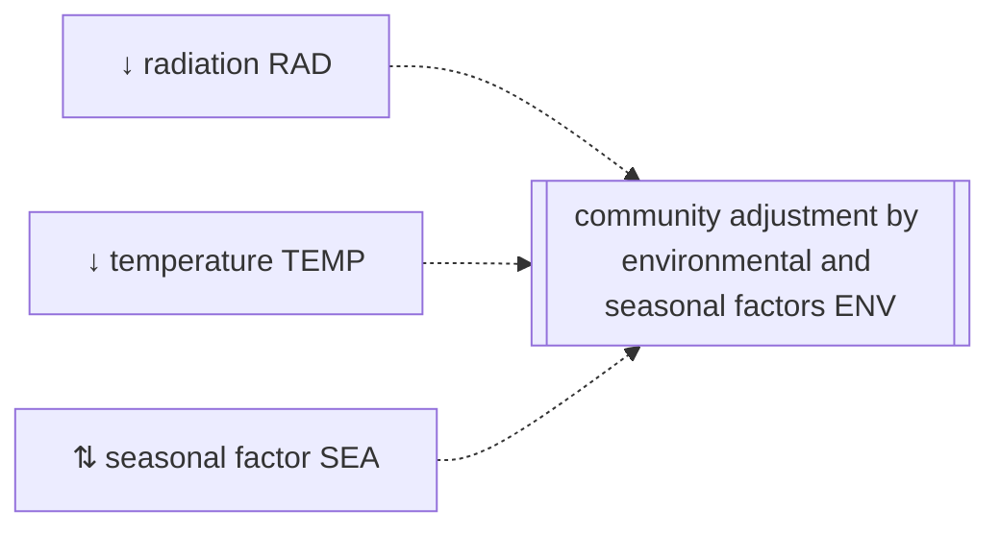

# Community growth adjustment by environmental and seasonal factors {#Community-growth-adjustment-by-environmental-and-seasonal-factors}
<script setup>
    import { onMounted } from 'vue';
    import { radiationReducerPlot } from './d3_plots/RadiationReducer.js';
    import { temperatureReducerPlot } from './d3_plots/TemperatureReducer.js';
    import { seasonalAdjustmentPlot } from './d3_plots/SeasonalAdjustment.js';
    
    onMounted(() => { 
        radiationReducerPlot(); 
        temperatureReducerPlot();
        seasonalAdjustmentPlot();
    });
</script>


The functions limit the growth of all plant species without any species-specific reduction:




The growth is adjusted for environmental and seasonal factors $ENV_{t}$ [-] that apply in the same way to all species:

$$ENV_{t} = RAD_{t} \cdot TEMP_{t} \cdot SEA_{t}$$

with the radiation $RAD_{t}$ [-], temperature $TEMP_{t}$ [-], and seasonal $SEA_{t}$ [-] growth adjustment factors.

## Radiation influence {#Radiation-influence}

The growth reducer due to too much radiation $RAD_{t}$ [-] is described by: 

$$RAD_{t} = \max\left(\min\left(1, 1 - \gamma_{RAD,1} \cdot \left(PAR_{t} - \gamma_{RAD,2}\right)\right), 0\right)$$

:::tabs

== Parameter
- $\gamma_{RAD,1}$ controls the steepness of the linear decrease in radiation use efficiency for high $PAR_{t}$ values [ha MJ⁻¹]
  
- $\gamma_{RAD,2}$ threshold value of $PAR_{t}$ from which starts a linear decrease in radiation use efficiency [MJ ha⁻¹]
  

== Variables

inputs:
- $PAR_{t}$ photosynthetically active radiation [MJ ha⁻¹]
  

:::

### Visualization {#Visualization}
<table>
    <colgroup>
        <col>
        <col width="120px">
        <col>
    </colgroup>
    <tbody>
    <tr>
        <td>steepness of the reduction γ_RAD_1</td>
        <td><span id="gamma1-value">4.45e-6</span></td>
        <td><input type="range" min="3e-6" max="6e-6" step="0.0000001" value="4.45e-6" id="gamma1" class="radiation_reducer_input"></td>
    </tr>
    <tr>
        <td>PAR at which the growth is reduced γ_RAD_2</td>
        <td><span id="gamma2-value">50000</span></td>
        <td><input type="range" min="30000.0" max="70000.0" step="10" value="50000.0" id="gamma2" class="radiation_reducer_input"></td>
    </tr>
    </tbody>
</table>
<svg id="radiation_reducer_graph"></svg>


### API {#API}
<details class='jldocstring custom-block' open>
<summary><a id='GrasslandTraitSim.radiation_reduction!' href='#GrasslandTraitSim.radiation_reduction!'><span class="jlbinding">GrasslandTraitSim.radiation_reduction!</span></a> <Badge type="info" class="jlObjectType jlFunction" text="Function" /></summary>


```julia
radiation_reduction!(; container, PAR)

```


Reduction of radiation use efficiency at high radiation levels.


<Badge type="info" class="source-link" text="source"><a href="https://github.com/FelixNoessler/GrasslandTraitSim.jl/blob/95dfc85525ff6ba5d69ef0c4ffbd50ee9d9825b3/src/3_biomass/1_growth/7_community_growth_reducers.jl#L1" target="_blank" rel="noreferrer">source</a></Badge>

</details>


## Temperature influence {#Temperature-influence}

The growth reduction factor due to too low or too high temperature $TEMP_{t}$ [-] is described by:

$$TEMP_{t} =
    \begin{cases}
    0 & \text{if } T_{t} < \omega_{TEMP,T_1} \\
    \frac{T_{t} - \omega_{TEMP,T_1}}{\omega_{TEMP,T_2} - \omega_{TEMP,T_1}} & \text{if } \omega_{TEMP,T_1} < T_{t} < \omega_{TEMP,T_2} \\
    1 & \text{if } \omega_{TEMP,T_2} < T_{t} < \omega_{TEMP,T_3} \\
    \frac{\omega_{TEMP,T_4} - T_{t}}{\omega_{TEMP,T_4} - \omega_{TEMP,T_3}} & \text{if } \omega_{TEMP,T_3} < T_{t} < \omega_{TEMP,T_4} \\
    0 & \text{if } T_{t} > \omega_{TEMP,T_4} \\
    \end{cases}$$

Equation are from [Jouven _et al._ (2006)](/references#Jouven2006) and theses are based on [Schapendonk _et al._ (1998)](/references#Schapendonk1998).

:::tabs

== Parameter
- $\omega_{TEMP,T_1}$ minimum temperature for growth [°C]
  
- $\omega_{TEMP,T_2}$ lower limit of optimum temperature for growth [°C]
  
- $\omega_{TEMP,T_3}$ upper limit of optimum temperature for growth [°C]
  
- $\omega_{TEMP,T_4}$ maximum temperature for growth [°C]
  

== Variables

inputs:
- $T_{t}$ mean air temperature [°C]
  

:::

### Visualization {#Visualization-2}
<table>
    <colgroup>
        <col>
        <col width="100px">
        <col>
    </colgroup>
    <tbody>
    <tr>
        <td>minimum temperature for growth ω_TEMP_T1</td>
        <td><span id="T0-value">4</span></td>
        <td><input type="range" min="0" max="5" step="0.1" value="4" id="T0" class="temperature_reducer_input"></td>
    </tr>
    <tr>
        <td>lower limit of optimum temperature for growth ω_TEMP_T2</td>
        <td><span id="T1-value">10</span></td>
        <td><input type="range" min="5" max="15" step="0.1" value="10" id="T1" class="temperature_reducer_input"></td>
    </tr>
    <tr>
        <td>upper limit of optimum temperature for growth ω_TEMP_T3</td>
        <td><span id="T2-value">20</span></td>
        <td><input type="range" min="15" max="25" step="0.1" value="20" id="T2" class="temperature_reducer_input"></td>
    </tr>
    <tr>
        <td>maximum temperature for growth ω_TEMP_T4</td>
        <td><span id="T3-value">35</span></td>
        <td><input type="range" min="30" max="40" step="0.1" value="35" id="T3" class="temperature_reducer_input"></td>
    </tr>
    </tbody>
</table>
<svg id="temperature_reducer_graph"></svg>


### API {#API-2}
<details class='jldocstring custom-block' open>
<summary><a id='GrasslandTraitSim.temperature_reduction!' href='#GrasslandTraitSim.temperature_reduction!'><span class="jlbinding">GrasslandTraitSim.temperature_reduction!</span></a> <Badge type="info" class="jlObjectType jlFunction" text="Function" /></summary>


```julia
temperature_reduction!(; container, T)

```


Reduction of the growth if the temperature is low or too high.


<Badge type="info" class="source-link" text="source"><a href="https://github.com/FelixNoessler/GrasslandTraitSim.jl/blob/95dfc85525ff6ba5d69ef0c4ffbd50ee9d9825b3/src/3_biomass/1_growth/7_community_growth_reducers.jl#L20" target="_blank" rel="noreferrer">source</a></Badge>

</details>


## Seasonal effect {#Seasonal-effect}

The seasonal growth adjustment factor $SEA_{t}$ [-] is desribed by: 

$$\begin{align}
    SEA_{t} &=
        \begin{cases}
        \zeta_{SEA\min} & \text{if}\;\; ST_{t} < 200\,°C  \\
        \zeta_{SEA\min} + (\zeta_{SEA\max} - \zeta_{SEA\min}) \cdot \frac{ST_{t} - 200\,°C}{\zeta_{SEA,ST_1} - 400\,°C} &
            \text{if}\;\; 200\,°C < ST_{t} < \zeta_{SEA,ST_1} - 200\,°C \\
        \zeta_{SEA\max} & \text{if}\;\; \zeta_{SEA,ST_1} - 200\,°C < ST_{t} < \zeta_{SEA,ST_1} - 100\,°C \\
        \zeta_{SEA\min} + (\zeta_{SEA\min} - \zeta_{SEA\max}) \cdot \frac{ST_{t} - \zeta_{SEA,ST_2}}{\zeta_{SEA,ST_2} - \zeta_{SEA,ST_1} - 100\,°C} &
            \text{if}\;\; \zeta_{SEA,ST_1} - 100\,°C < ST_{t} < \zeta_{SEA,ST_2} \\
        \zeta_{SEA\min} & \text{if}\;\; ST_{t} > \zeta_{SEA,ST_2}
        \end{cases} \\
    ST_{t} &= \sum_{i=t\bmod{365}}^{t} \max\left(0\,°C,\, T_{i} - 0\,°C\right)
\end{align}$$

This empirical function was developed by [Jouven _et al._ (2006)](/references#Jouven2006).

:::tabs

== Parameter
- $\zeta_{SEA,ST_1}$ threshold of the yearly accumulated temperature, above which the seasonality factor decreases from $\zeta_{SEA\max}$ to $\zeta_{SEA\min}$ [°C]
  
- $\zeta_{SEA,ST_2}$ threshold of the yearly accumulated temperature, above which the seasonality factor is set to $\zeta_{SEA\min}$ [°C]
  
- $\zeta_{SEA\min}$ minimum value of the seasonal effect [-]
  
- $\zeta_{SEA\max}$ maximum value of the seasonal effect [-]
  

== Variables

inputs:
- $T_{t}$ mean air temperature [°C]
  

intermediate variables:
- $ST_{t}$ yearly cumulative mean air temperature [°C]
  

:::

### Visualization {#Visualization-3}
<table>
    <colgroup>
        <col>
        <col width="50px">
        <col>
    </colgroup>
    <tbody>
    <tr>
        <td>ζ_ST₁</td>
        <td><span id="ST1-value">775</span></td>
        <td><input type="range" min="500" max="1000" step="1" value="775" id="ST1" class="seasonal_adj_input"></td>
    </tr>
    <tr>
        <td>ζ_ST₂</td>
        <td><span id="ST2-value">1450</span></td>
        <td><input type="range" min="1200" max="1800" step="1" value="1450" id="ST2" class="seasonal_adj_input"></td>
    </tr>
    <tr>
        <td>minimum value of the seasonal effect ζ_SEAmin</td>
        <td><span id="SEA_min-value">0.7</span></td>
        <td><input type="range" min="0.2" max="1" step="0.01" value="0.7" id="SEA_min" class="seasonal_adj_input"></td>
    </tr>
    <tr>
        <td>maximum value of the seasonal effect ζ_SEAmax</td>
        <td><span id="SEA_max-value">1.3</span></td>
        <td><input type="range" min="1" max="3" step="0.01" value="1.3" id="SEA_max" class="seasonal_adj_input"></td>
    </tr>
    </tbody>
</table>
<svg id="seasonal_adjustment_graph"></svg>


### API {#API-3}
<details class='jldocstring custom-block' open>
<summary><a id='GrasslandTraitSim.seasonal_reduction!' href='#GrasslandTraitSim.seasonal_reduction!'><span class="jlbinding">GrasslandTraitSim.seasonal_reduction!</span></a> <Badge type="info" class="jlObjectType jlFunction" text="Function" /></summary>


```julia
seasonal_reduction!(; container, ST)

```


Adjustment of growth due to seasonal effects.


<Badge type="info" class="source-link" text="source"><a href="https://github.com/FelixNoessler/GrasslandTraitSim.jl/blob/95dfc85525ff6ba5d69ef0c4ffbd50ee9d9825b3/src/3_biomass/1_growth/7_community_growth_reducers.jl#L50" target="_blank" rel="noreferrer">source</a></Badge>

</details>

