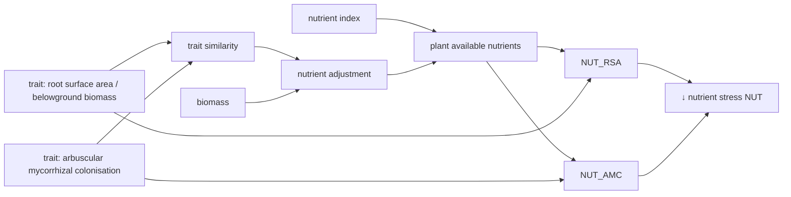

# Species-specific growth adjustment - Nutrients {#Species-specific-growth-adjustment-Nutrients}
<script setup>
    import { onMounted } from 'vue';
    import { nutrientAdjustmentPlot, nutrientStressRSAPlot, nutrientStressAMCPlot } from './d3_plots/NutrientStress.js';
    onMounted(() => { 
        nutrientAdjustmentPlot();
        nutrientStressRSAPlot();
        nutrientStressAMCPlot();
    });
</script>





The nutrient stress growth reducer $NUT_{ts}$ [-] is defined as:

$$NUT_{ts} = \max(NUT_{AMC, ts},\,NUT_{RSA, ts})$$

The growth reducers based on arbuscular mycorrhizal colonisation rate $NUT_{AMC, ts}$ and the root surface area $NUT_{RSA, ts}$ are described [below](/model/biomass/growth_species_specific_nutrients#Growth-reducers). The maximum of both response curves is used for the nutrient reduction function. It is assumed that the plants needs either many fine roots per above ground biomass or have a strong symbiosis with mycorrhizal fungi. Both functions use the calculation of the [plant available nutrients](/model/biomass/growth_species_specific_nutrients#Plant-available-nutrients).

## Growth reducers {#Growth-reducers}
- the nutrient stress growth reducer based on the arbuscular mycorrhizal colonisation rate $NUT_{AMC,ts}$ [-] is defined as:
  

$$\begin{align}
    NUT_{AMC,ts} &= 
    \begin{cases}
        0 & \text{if } R = 0 \\
        1 / \left(1 + \exp\left(-\beta_{NUT,amc}\cdot \left(N_{p, ts} - x_{0, N,AMC} \right)\right)\right) & \text{if } 0 < R < 1 \\
        1 & \text{if } R >= 1 \\
    \end{cases}  \\
   x_{0, N,AMC} &= \frac{1}{\beta_{NUT,amc}} \cdot  \left(-\delta_{NUT,amc}\cdot \left(TAMC_{ts} - \left(\frac{1}{\delta_{NUT,amc}} \cdot \log\left(\frac{1 - \alpha_{NUT,amc,05}}{\alpha_{NUT,amc,05}}\right) + \phi_{TAMC}\right)\right)\right) + 0.5  \\
    TAMC_{ts} &= \frac{B_{B, ts}}{B_{ts}} \cdot  amc_s  
\end{align}$$
- the nutrient stress growth reducer based on the root surface area $NUT_{RSA,ts}$ [-] is defined as:
  

$$\begin{align}
    NUT_{RSA,ts} &= 
    \begin{cases}
        0 & \text{if } R = 0 \\
        1 / \left(1 + \exp\left(-\beta_{NUT,rsa}\cdot \left(N_{p, ts} - x_{0, N,RSA} \right)\right)\right) & \text{if } 0 < R < 1 \\
        1 & \text{if } R >= 1 \\
    \end{cases}  \\
   x_{0, N,RSA} &= \frac{1}{\beta_{NUT,rsa}} \cdot  \left(-\delta_{NUT,rsa}\cdot \left(TRSA_{ts} - \left(\frac{1}{\delta_{NUT,rsa}} \cdot \log\left(\frac{1 - \alpha_{NUT,rsa,05}}{\alpha_{NUT,rsa,05}}\right) + \phi_{TRSA}\right)\right)\right) + 0.5  \\
    TRSA_{ts} &= \frac{B_{B, ts}}{B_{ts}} \cdot  rsa_s 
\end{align}$$

:::tabs

== Parameter
- $\phi_{TAMC}$ reference trait value [-]
  
- $\beta_{NUT,amc}$ slope of response function [-]
  
- $\alpha_{NUT,amc,05}$ response at $N_{p, ts} = 0.5$ for species with the reference trait value [-]
  
- $\delta_{NUT,amc}$ scales the difference in the growth reducer between species [-]
  
- $\phi_{TRSA}$ reference trait value [m² g⁻¹]
  
- $\beta_{NUT,rsa}$ slope of response function [-]
  
- $\alpha_{NUT,rsa,05}$ response at $N_{p, ts} = 0.5$ for species with the reference trait value [-]
  
- $\delta_{NUT,rsa}$ scales the difference in the growth reducer between species [g m⁻²]
  

== Variables

state variables:
- $B_{B, ts}$ belowground biomass of each species [kg ha⁻¹]
  
- $B_{ts}$ biomass of each species [kg ha⁻¹]
  

intermediate variables:
- $TRSA_{ts}$ root surface area per total biomass of each species [m² g⁻¹] 
  
- $TAMC_{ts}$ arbuscular mycorrhizal colonisation rate per total biomass of each species [-] 
  
- $N_{p, t}$ plant available nutrients, see [next section](/model/biomass/growth_species_specific_nutrients#Plant-available-nutrients) [-]
  

morphological traits:
- $rsa_s$ root surface area per belowground biomass of each species [m² g⁻¹]
  
- $amc_s$ arbuscular mycorrhizal colonisation rate [-]
  

:::

### Visualization {#Visualization}
- growth reducer based on root surface area per total biomass:
  
<table>
    <colgroup>
       <col>
       <col width="80px">
       <col>
    </colgroup>
    <tbody>
    <tr>
        <td>response at Np = 0.5 for species with the reference trait value α_NUT_rsa_05<br>(strong to weak growth reduction)</td>
        <td><span id="ɑ_RSA_05-value">0.9</span></td>
        <td><input type="range" id="ɑ_RSA_05" min="0.1" max="0.999" step="0.001" value="0.9" class="input_nutrient_rsa_graph"></td>
    </tr>
    <tr>
        <td>difference between species δ_NUT_rsa <br>(no to strong difference)</td>
        <td><span id="δ_RSA-value">10</span></td>
        <td><input type="range" id="δ_RSA" min="0.1" max="25.0" step="0.1" value="10" class="input_nutrient_rsa_graph"></td>
    </tr>
    <tr>
        <td>slope of response β_NUT_rsa</td>
        <td><span id="β_RSA-value">7</span></td>
        <td><input type="range" id="β_RSA" min="3" max="10" step="0.1" value="7" class="input_nutrient_rsa_graph"></td>
    </tr>
    <tr>
        <td>reference trait value ϕ_TRSA</td>
        <td><span id="phi_RSA-value">0.15</span></td>
        <td><input type="range" id="phi_RSA" min="0.05" max="0.25" step="0.05" value="0.15" class="input_nutrient_rsa_graph"></td>
    </tr>
    </tbody>
</table>

<svg id="nutrient_rsa_graph"></svg>

- growth reducer based on arbuscular mycorrhizal colonisation rate per total biomass:
  
<table>
    <colgroup>
       <col>
       <col width="80px">
       <col>
    </colgroup>
    <tbody>
        <tr>
            <td>response at Np = 0.5 for species with the reference trait value α_NUT_amc_05<br>(strong to weak growth reduction)</td>
            <td><span id="ɑ_AMC_05-value">0.9</span></td>
            <td><input type="range" id="ɑ_AMC_05" min="0.1" max="0.999" step="0.001" value="0.9" class="input_nutrient_amc_graph"></td>
        </tr>
        <tr>
            <td>difference between species δ_NUT_amc <br>(no to strong difference)</td>
            <td><span id="δ_AMC-value">10</span></td>
            <td><input type="range" id="δ_AMC" min="0.1" max="15.0" step="0.1" value="8" class="input_nutrient_amc_graph"></td>
        </tr>
        <tr>
            <td>slope of response β_NUT_amc</td>
            <td><span id="β_AMC-value">7</span></td>
            <td><input type="range" id="β_AMC" min="3" max="10" step="0.1" value="7" class="input_nutrient_amc_graph"></td>
        </tr>
        <tr>
            <td>reference trait value ϕ_TAMC</td>
            <td><span id="phi_AMC-value">0.2</span></td>
            <td><input type="range" id="phi_AMC" min="0.0" max="0.4" step="0.1" value="0.2" class="input_nutrient_amc_graph"></td>
        </tr>
    </tbody>
</table>

<svg id="nutrient_amc_graph"></svg>


### API {#API}
<details class='jldocstring custom-block' open>
<summary><a id='GrasslandTraitSim.nutrient_reduction!' href='#GrasslandTraitSim.nutrient_reduction!'><span class="jlbinding">GrasslandTraitSim.nutrient_reduction!</span></a> <Badge type="info" class="jlObjectType jlFunction" text="Function" /></summary>


```julia
nutrient_reduction!(; container, nutrients, total_biomass)

```


Reduction of growth based on plant available nutrients and the traits arbuscular mycorrhizal colonisation and root surface area per belowground biomass.


<Badge type="info" class="source-link" text="source"><a href="https://github.com/FelixNoessler/GrasslandTraitSim.jl/blob/95dfc85525ff6ba5d69ef0c4ffbd50ee9d9825b3/src/3_biomass/1_growth/4_nutrient_competition.jl#L87" target="_blank" rel="noreferrer">source</a></Badge>

</details>


## Plant available nutrients {#Plant-available-nutrients}

The plant available nutrients $N_{p, ts}$ [-] are described by:

$$\begin{align}
    N_{p, ts} &= \left(1 - \exp\left(-\omega_{NUT,N} \cdot N -\omega_{NUT,F}\cdot F\right)\right) \cdot NUT_{adj,ts} \\
    NUT_{adj,ts} &= \alpha_{NUT,maxadj} \cdot \exp\left(\frac{\log\left(\frac{1}{\alpha_{NUT,maxadj}}\right) \cdot \sum_{i=1}^{S} TS_{s,i} \cdot B_{ti}}{\alpha_{NUT,TSB}} \right) \\
    \mathbf{TS} &= 
        \begin{bmatrix}
            1 & TS_{1,2} & \dots &  & TS_{1,S} \\
            TS_{2,1} & 1 &  & \\
            \vdots &  & \ddots &  & \\
            TS_{S,1} & & & & 1 \\
        \end{bmatrix} \\
    \mathbf{TS} &= 1 - \frac{\mathbf{TD}}{\max(\mathbf{TD})} \\
    TD_{s,i} &= \sqrt{\left(RSA_{norm, s} - RSA_{norm, i}\right)^2 + \left( AMC_{norm, s} - AMC_{norm, i}\right)^2} \\
    RSA_{\text{norm}, s} &= \frac{rsa_s - \text{mean}(RSA)}{\text{sd}(RSA)} \\
    AMC_{\text{norm}, s} &= \frac{amc_s - \text{mean}(AMC)}{\text{sd}(AMC)} \\
\end{align}$$

:::tabs

== Parameter
- $\omega_{NUT,N}$ controls the influence of the total soil nitrogen on the nutrient index [kg gN⁻¹]
  
- $\omega_{NUT,F}$ controls the influence of the fertilization rate on the nutrient index [kg N⁻¹]
  
- $\alpha_{NUT,maxadj}$ maximum nutrient adjustment factor [-]
  
- $\alpha_{NUT,TSB}$ reference value, at $\alpha_{NUT,TSB} = TS_{s,i} \cdot B_{ti}$ is the nutrient adjustment factor $NUT_{adj,ts} = 1$ [kg ha⁻¹]
  

== Variables

inputs:
- $N$ total soil nitrogen [g kg⁻¹]
  
- $F$ fertilization [kg ha⁻¹]
  

state variables:
- $B_{ts}$ biomass of each species [kg ha⁻¹]
  

intermediate variables:
- $NUT_{adj,ts}$ density dependent nutrient adjustment factor [-]
  
- $TS_{s,i} \in [0, 1]$ trait similarity 
  
- $TD_{s,i}$ trait dissimilarity 
  
- $RSA_{\text{norm}, s}$ normalized root surface area per belowground biomass [-]
  
- $AMC_{\text{norm}, s}$ normalized arbuscular mycorrhizal colonisation rate [-]
  

morphological traits:
- $rsa_s$ root surface area per belowground biomass of each species [m² g⁻¹]
  
- $amc_s$ arbuscular mycorrhizal colonisation rate [-]
  

:::

### Visualization {#Visualization-2}
<table>
    <colgroup>
       <col>
       <col width="80px">
       <col>
    </colgroup>
    <tbody>
    <tr>
        <td>maximum nutrient adjustment factor α_NUT_maxadj</td>
        <td><span id="D_max-value"></span></td>
        <td><input type="range" id="D_max" min="1.0" max="15.0" step="0.1" value="10" class="nutrient_adjustment_graph_graph"></td>
    </tr>
    <tr>
        <td>reference value for ∑ TS ⋅ B α_NUT_TSB</td>
        <td><span id="α_TSB-value"></span></td>
        <td><input type="range" id="α_TSB" min="5000" max="40000" step="500" value="10000" class="nutrient_adjustment_graph_graph"></td>
    </tr>
    </tbody>
</table>
<svg id="nutrient_adjustment_graph"></svg>


### API {#API-2}
<details class='jldocstring custom-block' open>
<summary><a id='GrasslandTraitSim.similarity_matrix!' href='#GrasslandTraitSim.similarity_matrix!'><span class="jlbinding">GrasslandTraitSim.similarity_matrix!</span></a> <Badge type="info" class="jlObjectType jlFunction" text="Function" /></summary>


```julia
similarity_matrix!(; container)

```


Calculates the similarity between plants concerning their investment in fine roots and collaboration with mycorrhiza.


<Badge type="info" class="source-link" text="source"><a href="https://github.com/FelixNoessler/GrasslandTraitSim.jl/blob/95dfc85525ff6ba5d69ef0c4ffbd50ee9d9825b3/src/3_biomass/1_growth/4_nutrient_competition.jl#L15" target="_blank" rel="noreferrer">source</a></Badge>

</details>

<details class='jldocstring custom-block' open>
<summary><a id='GrasslandTraitSim.nutrient_competition!' href='#GrasslandTraitSim.nutrient_competition!'><span class="jlbinding">GrasslandTraitSim.nutrient_competition!</span></a> <Badge type="info" class="jlObjectType jlFunction" text="Function" /></summary>


```julia
nutrient_competition!(; container, total_biomass)

```


Models the density-dependent competiton for nutrients between plants.


<Badge type="info" class="source-link" text="source"><a href="https://github.com/FelixNoessler/GrasslandTraitSim.jl/blob/95dfc85525ff6ba5d69ef0c4ffbd50ee9d9825b3/src/3_biomass/1_growth/4_nutrient_competition.jl#L58" target="_blank" rel="noreferrer">source</a></Badge>

</details>

<details class='jldocstring custom-block' open>
<summary><a id='GrasslandTraitSim.input_nutrients!' href='#GrasslandTraitSim.input_nutrients!'><span class="jlbinding">GrasslandTraitSim.input_nutrients!</span></a> <Badge type="info" class="jlObjectType jlFunction" text="Function" /></summary>


```julia
input_nutrients!(; container)

```


Calculates nutrient index based on total soil nitrogen and fertilization.


<Badge type="info" class="source-link" text="source"><a href="https://github.com/FelixNoessler/GrasslandTraitSim.jl/blob/95dfc85525ff6ba5d69ef0c4ffbd50ee9d9825b3/src/3_biomass/1_growth/4_nutrient_competition.jl#L1" target="_blank" rel="noreferrer">source</a></Badge>

</details>

