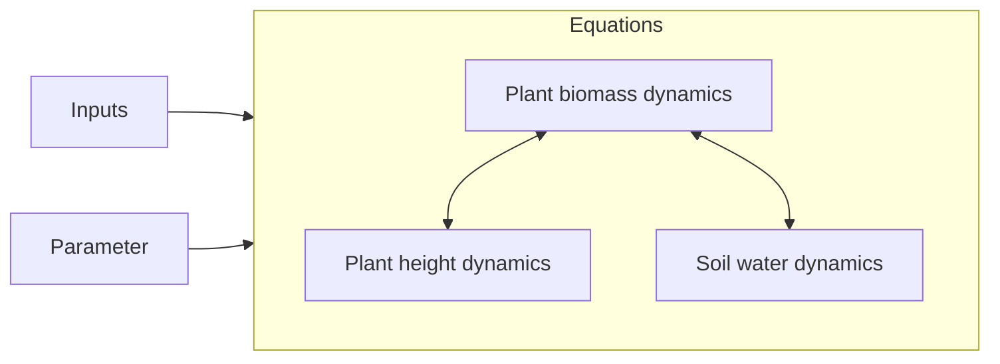

# Model description overview {#Model-description-overview}

Click on the links to view detailed documentation:




On this site you can find a rather technical overview of the procedure.

## Solve the difference equation {#Solve-the-difference-equation}

The main function to solve the difference equations and get the solution is [`solve_prob`](/model/index#GrasslandTraitSim.solve_prob).

### API
<details class='jldocstring custom-block' open>
<summary><a id='GrasslandTraitSim.solve_prob' href='#GrasslandTraitSim.solve_prob'><span class="jlbinding">GrasslandTraitSim.solve_prob</span></a> <Badge type="info" class="jlObjectType jlFunction" text="Function" /></summary>


```julia
solve_prob(
;
    input_obj,
    p,
    prealloc,
    prealloc_specific,
    trait_input,
    θ_type,
    callback
)

```


Solve the model for one site.

All input variables are explained in a tutorial: [How to prepare the input data to start a simulation](/tutorials/how_to_prepare_input#How-to-prepare-the-input-data-to-start-a-simulation)

There is also a tutorial on the model output: [How to analyse the model output](/tutorials/how_to_analyse_output#How-to-analyse-the-model-output)


[source](https://github.com/FelixNoessler/GrasslandTraitSim.jl/blob/083386dc75748e31525cf4ea66f74778601f0f0c/src/main_functions.jl#L1)

</details>


## Initialization

The initial conditions of the state variables are set. Each plant species gets an equal share of the initial biomass. The height is set to half of the maximum height of the species. The above- and belowground biomass are calculated based on the aboveground biomass proportion $abp_s$.

Traits can be either specified manually, or they will be generated with a  bivariate Gaussian mixture model with full covariance matrices. For each species either the first or the second Gaussian distribution is used to generate  the log/logit-transformed traits. The traits are then backtransformed to the original scale and the units are added. If the proportion of the leaf mass of the total plant mass $lbp_s$ is larger than 0.95 % of the proportion of the aboveground mass of the total mass $abp_s$, $lbp_s$ is set to 0.95 % of $abp_s$.  The Gaussian mixture model was fitted to the data with the function `BayesianGaussianMixture` of [Pedregosa _et al._ (2011)](/references#scikit-learn) to a set of grassland species that was found in Germany in the Biodiversity Exploratories. Here, you can get an  overview of the transformation of the traits:

|         trait |                                        description | transformation |
| -------------:| --------------------------------------------------:| --------------:|
|       $sla_s$ |                        specific leaf area [m² g⁻¹] |            log |
| $maxheight_s$ |                         potential plant height [m] |            log |
|       $lnc_s$ |   leaf nitrogen content per leaf dry mass [mg g⁻¹] |            log |
|       $rsa_s$ | root surface area per belowground biomass [m² g⁻¹] |            log |
|       $amc_s$ |       arbuscular mycorrhizal colonisation rate [-] |          logit |
|       $abp_s$ |        aboveground dry mass per plant dry mass [-] |          logit |
|       $lbp_s$ |               leaf dry mass per plant dry mass [-] |          logit |


### API {#API-2}
<details class='jldocstring custom-block' open>
<summary><a id='GrasslandTraitSim.initialization' href='#GrasslandTraitSim.initialization'><span class="jlbinding">GrasslandTraitSim.initialization</span></a> <Badge type="info" class="jlObjectType jlFunction" text="Function" /></summary>


```julia
initialization(
;
    input_obj,
    p,
    prealloc,
    prealloc_specific,
    trait_input,
    callback
)

```


Initialize the simulation object. The function is called once at the beginning of the simulation within [`solve_prob`](/model/index#GrasslandTraitSim.solve_prob).


[source](https://github.com/FelixNoessler/GrasslandTraitSim.jl/blob/083386dc75748e31525cf4ea66f74778601f0f0c/src/2_initialisation/3_initialisation.jl#L1)

</details>

<details class='jldocstring custom-block' open>
<summary><a id='GrasslandTraitSim.set_initialconditions!' href='#GrasslandTraitSim.set_initialconditions!'><span class="jlbinding">GrasslandTraitSim.set_initialconditions!</span></a> <Badge type="info" class="jlObjectType jlFunction" text="Function" /></summary>


```julia
set_initialconditions!(; container)

```


Set the initial conditions for the state variables.


[source](https://github.com/FelixNoessler/GrasslandTraitSim.jl/blob/083386dc75748e31525cf4ea66f74778601f0f0c/src/2_initialisation/3_initialisation.jl#L34)

</details>

<details class='jldocstring custom-block' open>
<summary><a id='GrasslandTraitSim.random_traits!' href='#GrasslandTraitSim.random_traits!'><span class="jlbinding">GrasslandTraitSim.random_traits!</span></a> <Badge type="info" class="jlObjectType jlFunction" text="Function" /></summary>


```julia
random_traits!(; container)

```


Generate random traits for the simulation.


[source](https://github.com/FelixNoessler/GrasslandTraitSim.jl/blob/083386dc75748e31525cf4ea66f74778601f0f0c/src/2_initialisation/5_traits.jl#L12)

</details>


## Main loop {#Main-loop}

For each time step the function [`one_day!`](/model/index#GrasslandTraitSim.one_day!) is executed and called from [`main_loop!`](/model/index#GrasslandTraitSim.main_loop!).

### API {#API-3}
<details class='jldocstring custom-block' open>
<summary><a id='GrasslandTraitSim.main_loop!' href='#GrasslandTraitSim.main_loop!'><span class="jlbinding">GrasslandTraitSim.main_loop!</span></a> <Badge type="info" class="jlObjectType jlFunction" text="Function" /></summary>


```julia
main_loop!(; container)

```


Run the main loop for all days. Calls the function [`one_day!`](/model/index#GrasslandTraitSim.one_day!) for each day and set the calculated density differences to the output variables.


[source](https://github.com/FelixNoessler/GrasslandTraitSim.jl/blob/083386dc75748e31525cf4ea66f74778601f0f0c/src/main_functions.jl#L29)

</details>

<details class='jldocstring custom-block' open>
<summary><a id='GrasslandTraitSim.one_day!' href='#GrasslandTraitSim.one_day!'><span class="jlbinding">GrasslandTraitSim.one_day!</span></a> <Badge type="info" class="jlObjectType jlFunction" text="Function" /></summary>


```julia
one_day!(; t, container)

```


Calculate differences of all state variables for one time step (one day).


[source](https://github.com/FelixNoessler/GrasslandTraitSim.jl/blob/083386dc75748e31525cf4ea66f74778601f0f0c/src/one_day.jl#L1)

</details>

