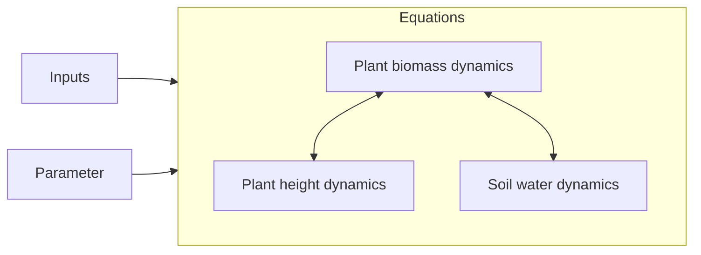

# Model description overview {#Model-description-overview}

Click on the links to view detailed documentation:




On this site you can find a rather technical overview of the procedure.

## Solve the difference equation {#Solve-the-difference-equation}

The main function to solve the difference equations and get the solution is [`solve_prob`](/model/index#GrasslandTraitSim.solve_prob).

### API {#API}
<details class='jldocstring custom-block' open>
<summary><a id='GrasslandTraitSim.solve_prob' href='#GrasslandTraitSim.solve_prob'><span class="jlbinding">GrasslandTraitSim.solve_prob</span></a> <Badge type="info" class="jlObjectType jlFunction" text="Function" /></summary>


```julia
solve_prob(; input_obj, p, prealloc, callback)

```


Solve the model for one site.

All input variables are explained in a tutorial: [How to prepare the input data to start a simulation](/tutorials/how_to_prepare_input#How-to-prepare-the-input-data-to-start-a-simulation)

There is also a tutorial on the model output: [How to analyse the model output](/tutorials/how_to_analyse_output#How-to-analyse-the-model-output)


<Badge type="info" class="source-link" text="source"><a href="https://github.com/FelixNoessler/GrasslandTraitSim.jl/blob/95dfc85525ff6ba5d69ef0c4ffbd50ee9d9825b3/src/main_functions.jl#L1" target="_blank" rel="noreferrer">source</a></Badge>

</details>


## Initialization {#Initialization}

The initial conditions of the state variables are set.

### API {#API-2}
<details class='jldocstring custom-block' open>
<summary><a id='GrasslandTraitSim.initialization' href='#GrasslandTraitSim.initialization'><span class="jlbinding">GrasslandTraitSim.initialization</span></a> <Badge type="info" class="jlObjectType jlFunction" text="Function" /></summary>


```julia
initialization(; input_obj, p, prealloc, callback)

```


Initialize the simulation object. The function is called once at the beginning of the simulation within [`solve_prob`](/model/index#GrasslandTraitSim.solve_prob).


<Badge type="info" class="source-link" text="source"><a href="https://github.com/FelixNoessler/GrasslandTraitSim.jl/blob/95dfc85525ff6ba5d69ef0c4ffbd50ee9d9825b3/src/2_initialisation/3_initialisation.jl#L1" target="_blank" rel="noreferrer">source</a></Badge>

</details>

<details class='jldocstring custom-block' open>
<summary><a id='GrasslandTraitSim.set_initialconditions!' href='#GrasslandTraitSim.set_initialconditions!'><span class="jlbinding">GrasslandTraitSim.set_initialconditions!</span></a> <Badge type="info" class="jlObjectType jlFunction" text="Function" /></summary>


```julia
set_initialconditions!(; container)

```


Set the initial conditions for the state variables.


<Badge type="info" class="source-link" text="source"><a href="https://github.com/FelixNoessler/GrasslandTraitSim.jl/blob/95dfc85525ff6ba5d69ef0c4ffbd50ee9d9825b3/src/2_initialisation/3_initialisation.jl#L26" target="_blank" rel="noreferrer">source</a></Badge>

</details>


## Main loop {#Main-loop}

For each time step the function [`one_day!`](/model/index#GrasslandTraitSim.one_day!) is executed and called from [`main_loop!`](/model/index#GrasslandTraitSim.main_loop!).

### API {#API-3}
<details class='jldocstring custom-block' open>
<summary><a id='GrasslandTraitSim.main_loop!' href='#GrasslandTraitSim.main_loop!'><span class="jlbinding">GrasslandTraitSim.main_loop!</span></a> <Badge type="info" class="jlObjectType jlFunction" text="Function" /></summary>


```julia
main_loop!(; container)

```


Run the main loop for all days. Calls the function [`one_day!`](/model/index#GrasslandTraitSim.one_day!) for each day and set the calculated density differences to the output variables.


<Badge type="info" class="source-link" text="source"><a href="https://github.com/FelixNoessler/GrasslandTraitSim.jl/blob/95dfc85525ff6ba5d69ef0c4ffbd50ee9d9825b3/src/main_functions.jl#L29" target="_blank" rel="noreferrer">source</a></Badge>

</details>

<details class='jldocstring custom-block' open>
<summary><a id='GrasslandTraitSim.one_day!' href='#GrasslandTraitSim.one_day!'><span class="jlbinding">GrasslandTraitSim.one_day!</span></a> <Badge type="info" class="jlObjectType jlFunction" text="Function" /></summary>


```julia
one_day!(; t, container)

```


Calculate differences of all state variables for one time step (one day).


<Badge type="info" class="source-link" text="source"><a href="https://github.com/FelixNoessler/GrasslandTraitSim.jl/blob/95dfc85525ff6ba5d69ef0c4ffbd50ee9d9825b3/src/one_day.jl#L1" target="_blank" rel="noreferrer">source</a></Badge>

</details>

