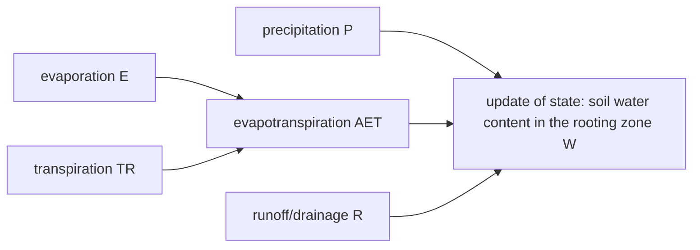

# Soil water dynamics {#Soil-water-dynamics}
<script setup>
    import { onMounted } from 'vue';
    import { WHCPWPPlot } from './plots.js';
    onMounted(() => { WHCPWPPlot(); });
</script>





The dynamics of the soil water content in the rooting zone $W_{t}$ [mm] is described by:

$$\begin{align}
W_{t+1} &= W_{t} + P_{t} - AET_{t} - R_{t} \\
AET_{t} &= \min\left(W_{t}, E_{t} + TR_{t}\right) \\
R_{t} &= \max\left(0\, \text{mm}, W_{t} + P_{t} - AET_{t} - WHC\right) \\
E_{t} &= \frac{W_{t}}{WHC} \cdot PET_{t} \cdot \left[1-\min\left(1, \frac{LAI_{tot, t}}{3}\right)\right] \\
TR_{t} &= 
    \max\left(0,\,\frac{W_{t} - PWP}{WHC - PWP}\right) \cdot 
    PET_{t} \cdot
    \min\left(1, \frac{LAI_{tot, t}}{3}\right)  \\
LAI_{tot, t} &= \sum_{s=1}^{S} LAI_{ts} \\
LAI_{ts} &= B_{A, ts} \cdot sla_s \cdot \frac{lbp_s}{abp_s} \cdot 0.1
\end{align}$$

Water holding capacity $WHC$ [mm] and permanent wilting point $PWP$ [mm] are derived by:

$$\begin{align}
WHC &= F_{WHC, } \cdot RD \\
PWP &= F_{PWP, } \cdot RD \\
F_{WHC, } &= \beta_{SND, WHC} \cdot SND + 
                    \beta_{SLT, WHC} \cdot SLT + 
                    \beta_{CLY, WHC} \cdot CLY +  
                    \beta_{OM, WHC} \cdot OM +
                    \beta_{BLK, WHC} \cdot BLK \\

F_{PWP, } &= \beta_{SND, PWP} \cdot SND + 
                    \beta_{SLT, PWP} \cdot SLT + 
                    \beta_{CLY, PWP} \cdot CLY + 
                    \beta_{OM, PWP} \cdot OM +
                    \beta_{BLK, PWP} \cdot BLK \\
\end{align}$$

Equations and parameter values for water holding capacity and permanent wilting point are based on [Gupta and Larson (1979)](/references#Gupta1979).

:::tabs

== Parameter
- $\beta_{SND, WHC}$ relates sand content to fraction of soil filled with water at $WHC$ [-]
  
- $\beta_{SLT, WHC}$ relates silt content to fraction of soil filled with water at $WHC$ [-]
  
- $\beta_{CLY, WHC}$ relates clay content to fraction of soil filled with water at $WHC$ [-]
  
- $\beta_{OM, WHC}$ relates organic matter content to fraction of soil filled with water at $WHC$ [-]
  
- $\beta_{BLK, WHC}$ relates bulk density to fraction of soil filled with water at $WHC$ [cm³ g⁻¹]
  
- $\beta_{SND, PWP}$ relates sand content to fraction of soil filled with water at $PWP$ [-]
  
- $\beta_{SLT, PWP}$ relates silt content to fraction of soil filled with water at $PWP$ [-]
  
- $\beta_{CLY, PWP}$ relates clay content to fraction of soil filled with water at $PWP$ [-]
  
- $\beta_{OM, PWP}$ relates organic matter content to fraction of soil filled with water at $PWP$ [-]
  
- $\beta_{BLK, PWP}$ relates bulk density to fraction of soil filled with water at $PWP$ [cm³ g⁻¹]
  

== Variables

inputs:
- $P_{t}$ precipitation [mm]
  
- $PET_{t}$ potential evapotranspiration [mm]
  
- $RD$ rooting depth [mm]
  
- $SND$ sand content [-]
  
- $SLT$ silt content [-]
  
- $CLY$ clay content [-]
  
- $OM$ organic matter content [-]
  
- $BLK$ bulk density [g cm⁻³]
  

state variables:
- $W_{t}$ water content in the rooting zone [mm]
  
- $B_{A, ts}$ aboveground biomass of each species [kg ha⁻¹]
  
- $B_{ts}$ biomass of each species [kg ha⁻¹]
  

intermediate variables:
- $AET_{t}$ actual evapotranspiration [mm]
  
- $R_{t}$ surface runoff/drainage [mm]
  
- $E_{t}$ evaporation [mm]
  
- $TR_{t}$ transpiration [mm]
  
- $LAI_{tot, t}$ leaf area index of the community [-]
  
- $LAI_{ts}$ leaf area index of each species [-]
  
- $WHC$ water holding capacity [mm] 
  
- $PWP$ permanent wilting point [mm]
  
- $F_{PWP, }$ fraction of the soil filled with water at the permanent wilting point [-]
  
- $F_{WHC, }$ fraction of the soil filled with water at the water holding capacity [-]
  

morphological traits:
- $sla_s$ specific leaf area of each species [m² g⁻¹]
  
- $lbp_s$ leaf biomass per aboveground plant biomass of each species [-]
  
- $abp_s$ aboveground biomass per plant biomass of each species [-]
  

:::

## Visualization {#Visualization}
- derive permanent wilting point and water holding capacity from soil characteristics:
  
<table>
    <colgroup>
        <col>
        <col width="100px">
        <col>
    </colgroup>
    <tbody>
    <tr>
        <td>root depth [mm]</td>
        <td><span id="rootdepth-value">200</span></td>
        <td><input type="range" id="rootdepth" min="50" max="500" step="1" value="200" class="input_whc_pwp_graph"></td>
    </tr>
    <tr>
        <td>organic matter content [-]</td>
        <td><span id="organic-value">0.05</span></td>
        <td><input type="range" id="organic" min="0.0" max="0.3" step="0.01" value="0.05" class="input_whc_pwp_graph"></td>
    </tr>
    <tr>
        <td>bulk density [g cm⁻³]</td>
        <td><span id="bulk-value">0.7</span></td>
        <td><input type="range" id="bulk" min="0.2" max="1.5" step="0.01" value="0.7" class="input_whc_pwp_graph"></td>
    </tr>
    <tr>
        <td>sand content [-]</td>
        <td><span id="sand-value">0.2</span></td>
        <td><input type="range" id="sand" min="0" max="1" step="0.01" value="0.2" class="input_whc_pwp_graph"></td>
    </tr>
    <tr>
        <td>silt content [-]</td>
        <td><span id="silt-value">0.5</span></td>
        <td><input type="range" id="silt" min="0" max="1" step="0.01" value="0.5" class="input_whc_pwp_graph"></td>
    </tr>
    <tr>
        <td>clay content [-]</td>
        <td><span id="clay-value">0.3</span></td>
        <td></td>
    </tr>
    </tbody>
</table>
<svg id="whc_pwp_graph"></svg>


## API {#API}
<details class='jldocstring custom-block' open>
<summary><a id='GrasslandTraitSim.change_water_reserve' href='#GrasslandTraitSim.change_water_reserve'><span class="jlbinding">GrasslandTraitSim.change_water_reserve</span></a> <Badge type="info" class="jlObjectType jlFunction" text="Function" /></summary>


```julia
change_water_reserve(
;
    container,
    water,
    precipitation,
    PET,
    WHC,
    PWP
)

```


Simulates the change of the soil water content in the rooting zone within one time step.


<Badge type="info" class="source-link" text="source"><a href="https://github.com/FelixNoessler/GrasslandTraitSim.jl/blob/95dfc85525ff6ba5d69ef0c4ffbd50ee9d9825b3/src/5_water/water.jl#L1" target="_blank" rel="noreferrer">source</a></Badge>

</details>

<details class='jldocstring custom-block' open>
<summary><a id='GrasslandTraitSim.transpiration' href='#GrasslandTraitSim.transpiration'><span class="jlbinding">GrasslandTraitSim.transpiration</span></a> <Badge type="info" class="jlObjectType jlFunction" text="Function" /></summary>


```julia
transpiration(; container, water, PWP, WHC, PET, LAItot)

```


Simulates transpiration from the vegetation.


<Badge type="info" class="source-link" text="source"><a href="https://github.com/FelixNoessler/GrasslandTraitSim.jl/blob/95dfc85525ff6ba5d69ef0c4ffbd50ee9d9825b3/src/5_water/water.jl#L23" target="_blank" rel="noreferrer">source</a></Badge>

</details>

<details class='jldocstring custom-block' open>
<summary><a id='GrasslandTraitSim.evaporation' href='#GrasslandTraitSim.evaporation'><span class="jlbinding">GrasslandTraitSim.evaporation</span></a> <Badge type="info" class="jlObjectType jlFunction" text="Function" /></summary>


```julia
evaporation(; water, WHC, PET, LAItot)

```


Simulate evaporation of water from the soil.


<Badge type="info" class="source-link" text="source"><a href="https://github.com/FelixNoessler/GrasslandTraitSim.jl/blob/95dfc85525ff6ba5d69ef0c4ffbd50ee9d9825b3/src/5_water/water.jl#L33" target="_blank" rel="noreferrer">source</a></Badge>

</details>

<details class='jldocstring custom-block' open>
<summary><a id='GrasslandTraitSim.input_WHC_PWP!' href='#GrasslandTraitSim.input_WHC_PWP!'><span class="jlbinding">GrasslandTraitSim.input_WHC_PWP!</span></a> <Badge type="info" class="jlObjectType jlFunction" text="Function" /></summary>


```julia
input_WHC_PWP!(; container)

```


Derive walter holding capacity (WHC) and permanent wilting point (PWP) from soil properties.


<Badge type="info" class="source-link" text="source"><a href="https://github.com/FelixNoessler/GrasslandTraitSim.jl/blob/95dfc85525ff6ba5d69ef0c4ffbd50ee9d9825b3/src/5_water/water.jl#L40" target="_blank" rel="noreferrer">source</a></Badge>

</details>

