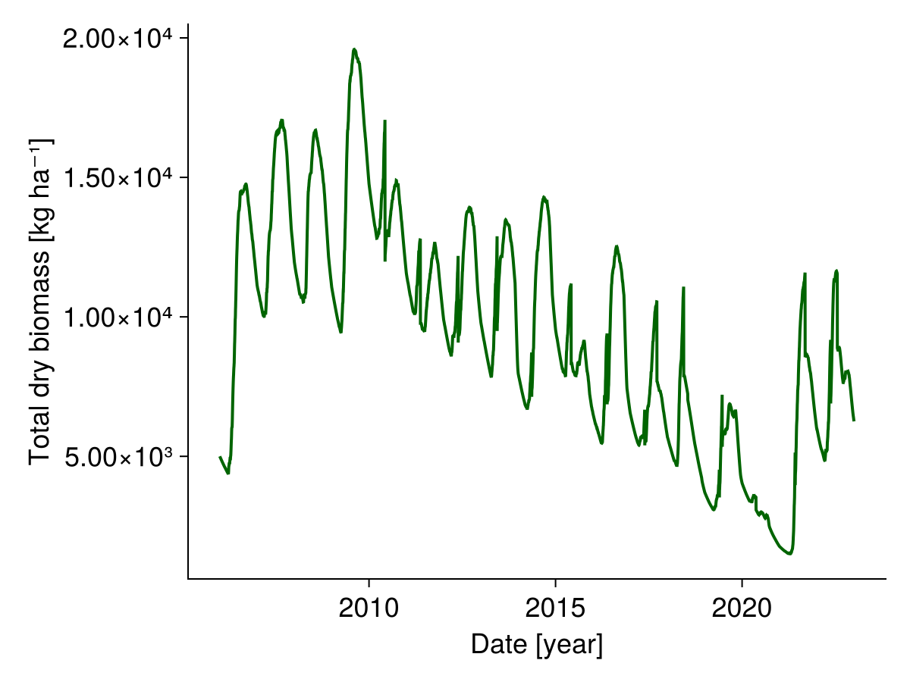
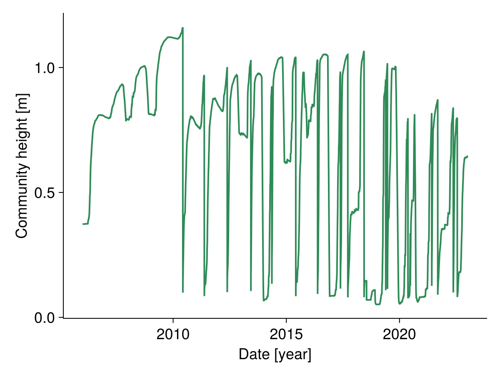
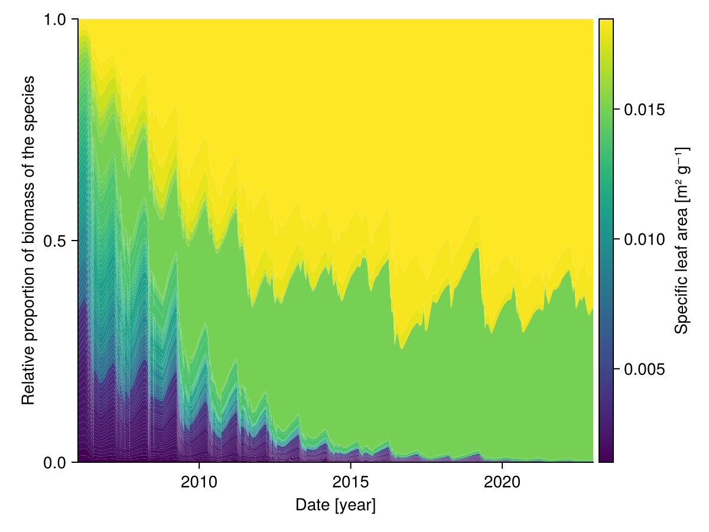
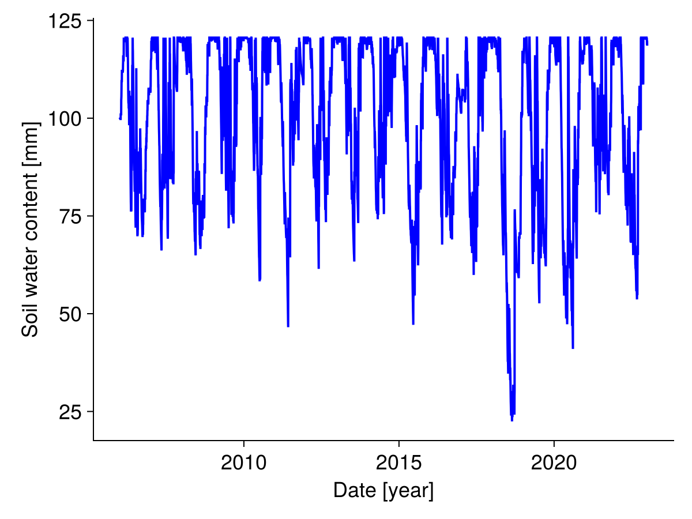
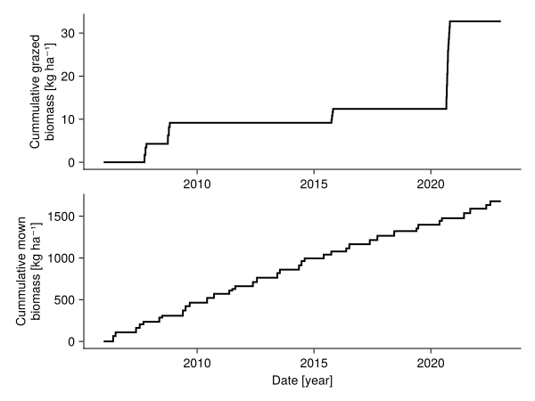
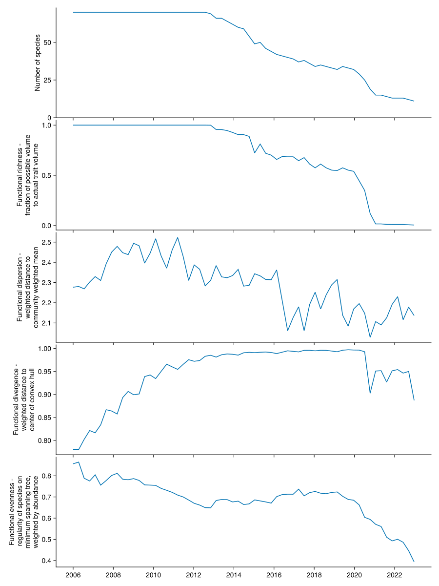

# How to analyse the model output {#How-to-analyse-the-model-output}

I assume that you have read the tutorial on how to prepare the input data and run a simulation (see [here](/tutorials/how_to_prepare_input#How-to-prepare-the-input-data-to-start-a-simulation)). In this tutorial, we will analyse the output of the simulation that is stored in the object `sol`.

```julia
import GrasslandTraitSim as sim

using Statistics
using CairoMakie
using Unitful
using RCall # only for functional diversity indices
CairoMakie.activate!()

trait_input = sim.input_traits()
input_obj = sim.validation_input("HEG01");
p = sim.optim_parameter()
sol = sim.solve_prob(; input_obj, p, trait_input);
```


## Biomass

We can look at the simulated biomass:

```julia
sol.output.biomass
```


```
╭──────────────────────────────────────────────────────────────────────────────╮
│ 6210×1×1×70 DimArray{Unitful.Quantity{Float64, 𝐌 𝐋^-2, Unitful.FreeUnits{(ha^-1, kg), 𝐌 𝐋^-2, nothing}},4} state_biomass │
├──────────────────────────────────────────────────────────────────────── dims ┤
  ↓ time    Sampled{Dates.Date} Dates.Date("2006-01-01"):Dates.Day(1):Dates.Date("2023-01-01") ForwardOrdered Regular Points,
  → x       Sampled{Int64} 1:1 ForwardOrdered Regular Points,
  ↗ y       Sampled{Int64} 1:1 ForwardOrdered Regular Points,
  ⬔ species Sampled{Int64} 1:70 ForwardOrdered Regular Points
└──────────────────────────────────────────────────────────────────────────────┘
[:, :, 1, 1]
 ↓ →                                   1
  2006-01-01    71.4286 kg ha^-1
  2006-01-02    71.3399 kg ha^-1
  2006-01-03    71.2514 kg ha^-1
 ⋮                    
  2022-12-29   0.100067 kg ha^-1
  2022-12-30   0.099876 kg ha^-1
  2022-12-31  0.0996935 kg ha^-1
  2023-01-01  0.0995072 kg ha^-1
```


The four dimension of the array are: daily time step, patch x dim, patch y dim, and species.  For plotting the values with `Makie.jl`, we have to remove the units with `ustrip`:

```julia
# if we have more than one patch per site, we have to first calculate the mean biomass per site
species_biomass = dropdims(mean(sol.output.biomass; dims = (:x, :y)); dims = (:x, :y))
total_biomass = vec(sum(species_biomass; dims = :species))

fig, _ = lines(sol.simp.output_date_num, ustrip.(total_biomass), color = :darkgreen, linewidth = 2;
      axis = (; ylabel = "Total dry biomass [kg ha⁻¹]",
                xlabel = "Date [year]"))
fig
```



## Height of the community {#Height-of-the-community}

We can also look at the simulated height of each species:

```julia
sol.output.height
```


```
╭──────────────────────────────────────────────────────────────────────────────╮
│ 6210×1×1×70 DimArray{Unitful.Quantity{Float64, 𝐋, Unitful.FreeUnits{(m,), 𝐋, nothing}},4} state_height │
├──────────────────────────────────────────────────────────────────────── dims ┤
  ↓ time    Sampled{Dates.Date} Dates.Date("2006-01-01"):Dates.Day(1):Dates.Date("2023-01-01") ForwardOrdered Regular Points,
  → x       Sampled{Int64} 1:1 ForwardOrdered Regular Points,
  ↗ y       Sampled{Int64} 1:1 ForwardOrdered Regular Points,
  ⬔ species Sampled{Int64} 1:70 ForwardOrdered Regular Points
└──────────────────────────────────────────────────────────────────────────────┘
[:, :, 1, 1]
 ↓ →                           1
  2006-01-01       0.4 m
  2006-01-02       0.4 m
  2006-01-03       0.4 m
 ⋮                    
  2022-12-29  0.235389 m
  2022-12-30   0.23564 m
  2022-12-31  0.236601 m
  2023-01-01  0.237188 m
```


We calculate the height of the community by weighting the height of the species by their proportion of biomass on the total biomass:

```julia
species_biomass = dropdims(mean(sol.output.biomass; dims = (:x, :y)); dims = (:x, :y))
total_biomass = vec(sum(species_biomass; dims = :species))
species_height = dropdims(mean(sol.output.height; dims = (:x, :y)); dims = (:x, :y))
community_height = vec(sum(species_height .* species_biomass ./ total_biomass; dims = :species))

fig, _ = lines(sol.simp.output_date_num, ustrip.(community_height),
                color = :seagreen, linewidth = 2;
    axis = (; ylabel = "Community height [m]",
                xlabel = "Date [year]"))
fig
```



## Share of each species {#Share-of-each-species}

We can look at the share of each species over time:
<details><summary>show code</summary>


```julia
# colors are assigned according to the specific leaf area (SLA)
color = ustrip.(sol.traits.sla)
colormap = :viridis
colorrange = (minimum(color), maximum(color))
is = sortperm(color)
cmap = cgrad(colormap)
colors = [cmap[(co .- colorrange[1]) ./ (colorrange[2] - colorrange[1])]
          for co in color[is]]

# calculate biomass proportion of each species
biomass_site = dropdims(mean(sol.output.biomass; dims=(:x, :y)); dims = (:x, :y))
biomass_ordered = biomass_site[:, sortperm(color)]
biomass_fraction = biomass_ordered ./ sum(biomass_ordered; dims = :species)
biomass_cumfraction = cumsum(biomass_fraction; dims = 2)

begin
    fig = Figure()
    Axis(fig[1,1]; ylabel = "Relative proportion of biomass of the species",
         xlabel = "Date [year]",
         limits = (sol.simp.output_date_num[1], sol.simp.output_date_num[end], 0, 1))

    for i in 1:sol.simp.nspecies
        ylower = nothing
        if i == 1
            ylower = zeros(size(biomass_cumfraction, 1))
        else
            ylower = biomass_cumfraction[:, i-1]
        end
        yupper = biomass_cumfraction[:, i]

        band!(sol.simp.output_date_num, vec(ylower), vec(yupper);
              color = colors[i])
    end

    Colorbar(fig[1,2]; limits = colorrange, colormap = cmap,
             label = "Specific leaf area [m² g⁻¹]")

    fig
end
```

</details>





## Soil water content {#Soil-water-content}

Similarly, we plot the soil water content over time:

```julia
# if we have more than one patch per site,
# we have to first calculate the mean soil water content per site
soil_water_per_site = dropdims(mean(sol.output.water; dims = (:x, :y)); dims = (:x, :y))

fig, _ = lines(sol.simp.output_date_num, vec(ustrip.(soil_water_per_site)), color = :blue, linewidth = 2;
      axis = (; ylabel = "Soil water content [mm]", xlabel = "Date [year]"))
fig
```



## Community weighted mean traits {#Community-weighted-mean-traits}

We can calculate for all traits the community weighted mean over time:
<details><summary>show code</summary>


```julia
relative_biomass = species_biomass ./ total_biomass
traits = [:maxheight, :sla, :lnc, :rsa, :amc, :abp, :lbp]
trait_names = [
    "Maximum\n height [m]", "Specific leaf\narea [m² g⁻¹]", "Leaf nitrogen \nper leaf mass\n [mg g⁻¹]",
    "Root surface\narea per below\nground biomass\n[m² g⁻¹]", "Arbuscular\n mycorrhizal\n colonisation",
    "Aboveground\nbiomass per total\nbiomass [-]", "Leaf biomass\nper total \nbiomass [-]"]

begin
    fig = Figure(; size = (500, 1000))

    for i in eachindex(traits)
        trait_vals = sol.traits[traits[i]]
        weighted_trait = trait_vals .* relative_biomass'
        cwm_trait = vec(sum(weighted_trait; dims = 1))

        Axis(fig[i, 1];
                xlabel = i == length(traits) ? "Date [year]" : "",
                xticklabelsvisible = i == length(traits) ? true : false,
                ylabel = trait_names[i])
        lines!(sol.simp.output_date_num, ustrip.(cwm_trait);
                color = :black, linewidth = 2)

    end

    [rowgap!(fig.layout, i, 5) for i in 1:length(traits)-1]

    fig
end
```

</details>


## Grazed and mown biomass {#Grazed-and-mown-biomass}

We can look at the grazed and mown biomass over time:
<details><summary>show code</summary>


```julia
# total
sum(sol.output.mown)
sum(sol.output.grazed)

# plot the grazed and mown biomass over time
grazed_site = dropdims(mean(sol.output.grazed; dims=(:x, :y, :species)); dims=(:x, :y, :species))
cum_grazed = cumsum(grazed_site)

mown_site = dropdims(mean(sol.output.mown; dims=(:x, :y, :species)); dims=(:x, :y, :species))
cum_mown = cumsum(mown_site)
begin
      fig = Figure()
      Axis(fig[1,1]; ylabel = "Cummulative grazed\nbiomass [kg ha⁻¹]")
      lines!(sol.simp.mean_input_date_num, ustrip.(vec(cum_grazed)), color = :black, linewidth = 2;)
      Axis(fig[2,1]; ylabel = "Cummulative mown\nbiomass [kg ha⁻¹]", xlabel = "Date [year]")
      lines!(sol.simp.mean_input_date_num, ustrip.(vec(cum_mown)), color = :black, linewidth = 2;)
      fig
end
```

</details>





## Functional diversity indices {#Functional-diversity-indices}

We use the R-package `fundiversity` to compute the functional diversity indices. We run the R-code from Julia using the Julia package `RCall.jl`.
<details><summary>show code</summary>


```julia
################ Calculate functional diversity in R
function traits_to_matrix(trait_data; std_traits = true)
    trait_names = keys(trait_data)
    ntraits = length(trait_names)
    nspecies = length(trait_data[trait_names[1]])
    m = Matrix{Float64}(undef, nspecies, ntraits)

    for i in eachindex(trait_names)
        tdat = trait_data[trait_names[i]]
        if std_traits
            m[:, i] = (tdat .- mean(tdat)) ./ std(tdat)
        else
            m[:, i] = ustrip.(tdat)
        end
    end

    return m
end

trait_input_wo_lbp = Base.structdiff(trait_input, (; lbp = nothing))

tstep = 100
biomass = sol.output.biomass[1:tstep:end, 1, 1, :]
biomass_R = ustrip.(biomass.data)
traits_R = traits_to_matrix(trait_input_wo_lbp;)
site_names = string.("time_", 1:size(biomass_R, 1))
species_names = string.("species_", 1:size(biomass_R, 2))

## transfer data to R
@rput species_names site_names traits_R biomass_R

R"""
library(fundiversity)

rownames(traits_R) <- species_names
rownames(biomass_R) <- site_names
colnames(biomass_R) <- species_names

fric_std_R <- fd_fric(traits_R, biomass_R, stand = TRUE)$FRic
fdis_R <- fd_fdis(traits_R, biomass_R)$FDis
fdiv_R <- fd_fdiv(traits_R, biomass_R)$FDiv
feve_R <- fd_feve(traits_R, biomass_R)$FEve
"""

## get results back from R
@rget fric_std_R fdis_R fdiv_R feve_R

begin
    fig = Figure(size = (900, 1200))

    Axis(fig[1, 1]; ylabel = "Number of species", xticks = 2006:2:2022,
         xticklabelsvisible = false, limits = (nothing, nothing, 0, nothing))
    nspecies = sum(sol.output.biomass[1:tstep:end, 1, 1, :] .> 0.0u"kg / ha"; dims = :species)
    lines!(sol.simp.output_date_num[1:tstep:end], vec(nspecies);)

    Axis(fig[2, 1]; yscale = identity, xticks = 2006:2:2022, xticklabelsvisible = false,
         ylabel = "Functional richness -\nfraction of possible volume\nto actual trait volume")
    lines!(sol.simp.output_date_num[1:tstep:end], fric_std_R)

    Axis(fig[3, 1]; xticks = 2006:2:2022, xticklabelsvisible = false,
         ylabel = "Functional dispersion -\nweighted distance to\ncommunity weighted mean")
    lines!(sol.simp.output_date_num[1:tstep:end], fdis_R)

    Axis(fig[4, 1]; xticks = 2006:2:2022, xticklabelsvisible = false,
        ylabel = "Functional divergence -\nweighted distance to\ncenter of convex hull")
    lines!(sol.simp.output_date_num[1:tstep:end], fdiv_R)

    Axis(fig[5, 1]; xticks = 2006:2:2022, xticklabelsvisible = true,
        ylabel = "Functional evenness -\n regularity of species on\nminimum spanning tree,\nweighted by abundance")
    lines!(sol.simp.output_date_num[1:tstep:end], feve_R)

    fig
end
```

</details>





## Shannon and Simpson diversity {#Shannon-and-Simpson-diversity}

We can calculate the Shannon and Simpson diversity over time:
<details><summary>show code</summary>


```julia
biomass_site = dropdims(mean(sol.output.biomass; dims = (:x, :y)); dims = (:x, :y))
tend = size(biomass_site, 1)
shannon = Array{Float64}(undef, tend)
simpson = Array{Float64}(undef, tend)
for t in 1:tend
    b1 = biomass_site[t, :]
    b1 = b1[.!iszero.(b1)]
    p1 = b1 ./ sum(b1)
    shannon[t] = -sum(p1 .* log.(p1))
    simpson[t] = 1 - sum(p1 .^ 2)
end

begin
    fig = Figure()
    Axis(fig[1,1]; ylabel = "Shannon index")
    lines!(sol.simp.output_date_num, shannon, color = :black, linewidth = 2;)
    Axis(fig[2,1]; ylabel = "Simpson index", xlabel = "Date [year]")
    lines!(sol.simp.output_date_num, simpson, color = :black, linewidth = 2;)
    fig
end
```

</details>


