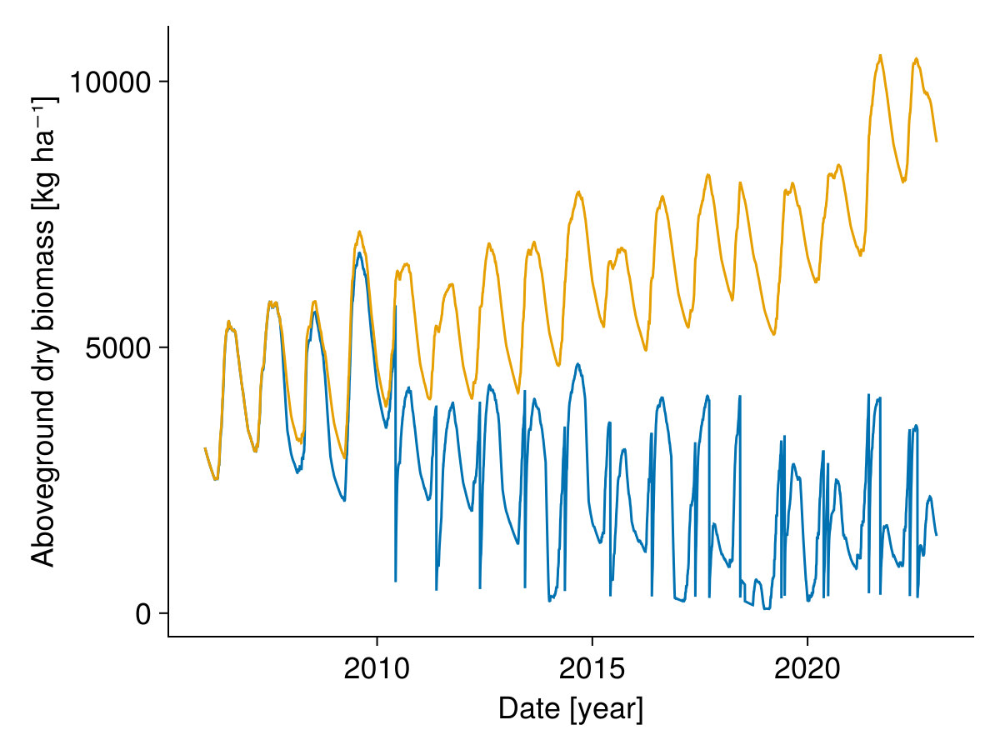

# How to model heterogeneous site conditions or management {#How-to-model-heterogeneous-site-conditions-or-management}

This tutorial assumes that you have read the basic tutorial [How to prepare the input data to start a simulation](/tutorials/how_to_prepare_input#How-to-prepare-the-input-data-to-start-a-simulation). We will use an existing input object and change the number of patches to two and remove the management in the second patch.

```julia
import GrasslandTraitSim as sim

using CairoMakie
using DimensionalData
using Statistics
using Unitful

patch_xdim = 2
patch_ydim = 1

input_obj_prep = sim.validation_input("HEG01"; nspecies = 70, trait_seed = 99);

# --------------- change the number of patches
simp_prep = Dict()
for k in keys(input_obj_prep.simp)
    simp_prep[k] = input_obj_prep.simp[k]
end
simp_prep[:patch_xdim] = patch_xdim
simp_prep[:patch_ydim] = patch_ydim
simp_prep[:npatches] = patch_xdim * patch_ydim
simp_prep[:ts] = input_obj_prep.simp.ts
simp = NamedTuple(simp_prep)

# --------------- transform (copy) one dimensional to two dimensional arrays in x-direction
t_axis_exist(x) = !isnothing(DimensionalData.dims(x, :t))
daily_input_prep = Dict()
for k in keys(input_obj_prep.input)
    dat = input_obj_prep.input[k]
    dat_new = t_axis_exist(dat) ? dat[:, [1, 1], :] : dat[[1, 1], :]
    daily_input_prep[k] = set(dat_new, :x => 1:2)
end

# --------------- change the management
mowing_prep = daily_input_prep[:CUT_mowing]
CUT_mowing = Array{Union{Missing, typeof(1.0u"m")}}(missing, length(mowing_prep) ÷ 2, patch_xdim, patch_ydim)
CUT_mowing[:, 1, 1] .= mowing_prep[:, 1, 1]

grazing_prep = daily_input_prep[:LD_grazing]
LD_grazing = Array{Union{Missing, typeof(1.0u"ha^-1")}}(missing, length(grazing_prep) ÷ 2, patch_xdim, patch_ydim)
LD_grazing[:, 1, 1] .= grazing_prep[:, 1, 1]

daily_input_prep[:CUT_mowing] = CUT_mowing
daily_input_prep[:LD_grazing] = LD_grazing
input = NamedTuple(daily_input_prep)

# --------------- add everything together

input_obj = (; input, simp)
p = sim.optim_parameter()
trait_input = sim.input_traits()
sol = sim.solve_prob(; input_obj, p, trait_input);

patch_biomass = dropdims(sum(sol.output.above_biomass; dims = :species); dims = :species)

begin
    fig = Figure()
    Axis(fig[1, 1];
         ylabel = "Aboveground dry biomass [kg ha⁻¹]",
         xlabel = "Date [year]")

    for x in Base.OneTo(patch_xdim)
        for y in Base.OneTo(patch_ydim)
            lines!(sol.simp.output_date_num, vec(ustrip.(patch_biomass[:, x, y]));)
        end
    end

    fig
end
```


