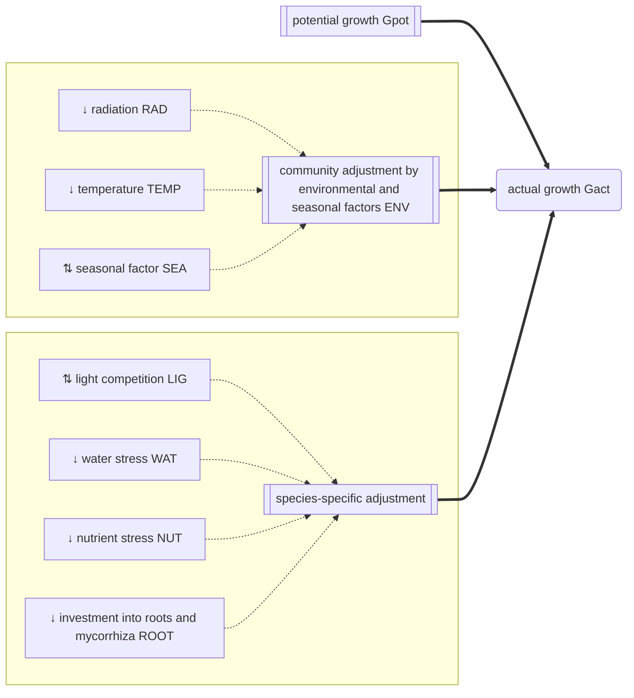

```@meta
CurrentModule=GrasslandTraitSim
```

# Growth

Click on a process to view detailed documentation:



The actual growth ``G_{act, txys}`` [kg ha⁻¹] is derived from the community potential growth ``G_{pot, txy}`` [kg ha⁻¹] and the multiplicative effect of five growth adjustment factors:
```math
G_{act, txys} = G_{pot, txy} \cdot LIG_{txys} \cdot NUT_{txys} \cdot WAT_{txys} \cdot ROOT_{txys} \cdot ENV_{txy}
```
where ``LIG_{txys}`` [-] is the species-specific competition for light, ``NUT_{txys}`` [-] is the species-specific competition for nutrients, ``WAT_{txys}`` [-] is the species-specific competition for soil water, ``ROOT_{txys}`` [-] is the species-specific cost for maintaining roots and mycorrhiza, and ``ENV_{txy}`` [-] is the non-species specific adjustment based on environmental and seasonal factors.

## API

```@docs
growth!
```
