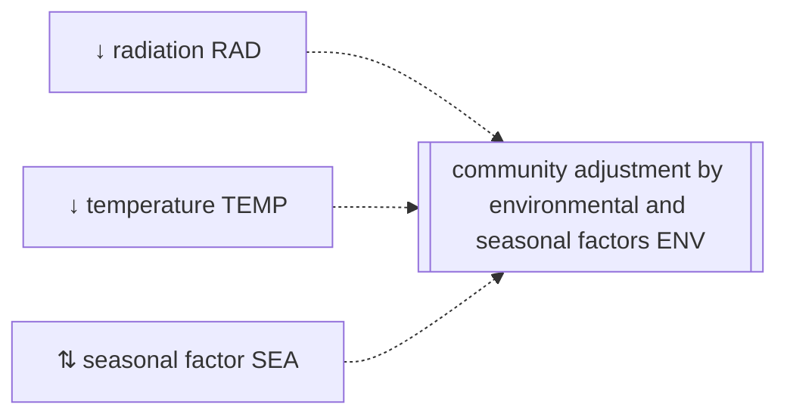

```@meta
CurrentModule=GrasslandTraitSim
```

# Community growth adjustment by environmental and seasonal factors

```@raw html
<script setup>
    import { onMounted } from 'vue';
    import { radiationReducerPlot } from './d3_plots/RadiationReducer.js';
    import { temperatureReducerPlot } from './d3_plots/TemperatureReducer.js';
    import { seasonalAdjustmentPlot } from './d3_plots/SeasonalAdjustment.js';
    
    onMounted(() => { 
        radiationReducerPlot(); 
        temperatureReducerPlot();
        seasonalAdjustmentPlot();
    });
</script>
```


The functions limit the growth of all plant species without any species-specific reduction:


The growth is adjusted for environmental and seasonal factors ``ENV_{txy}`` [-] that apply in the same way to all species:
```math
ENV_{txy} = RAD_{txy} \cdot TEMP_{txy} \cdot SEA_{txy}
```
with the radiation ``RAD_{txy}`` [-], temperature ``TEMP_{txy}`` [-], and seasonal ``SEA_{txy}`` [-] growth adjustment factors.


## Radiation influence


The growth reducer due to too much radiation ``RAD_{txy}`` [-] is described by: 

```math
RAD_{txy} = \max\left(\min\left(1, 1 - \gamma_{RAD,1} \cdot \left(PAR_{txys} - \gamma_{RAD,2}\right)\right), 0\right)
```

:::tabs

== Parameter

- ``\gamma_{RAD,1}`` controls the steepness of the linear decrease in
  radiation use efficiency for high ``PAR_{txy}`` values [ha MJ⁻¹]
- ``\gamma_{RAD,2}`` threshold value of ``PAR_{txy}`` from which starts
  a linear decrease in radiation use efficiency [MJ ha⁻¹]

== Variables

inputs:
- ``PAR_{txy}`` photosynthetically active radiation [MJ ha⁻¹]

:::


### Visualization
```@raw html
<table>
    <colgroup>
        <col>
        <col width="120px">
        <col>
    </colgroup>
    <tbody>
    <tr>
        <td>steepness of the reduction γ_RAD_1</td>
        <td><span id="gamma1-value">4.45e-6</span></td>
        <td><input type="range" min="3e-6" max="6e-6" step="0.0000001" value="4.45e-6" id="gamma1" class="radiation_reducer_input"></td>
    </tr>
    <tr>
        <td>PAR at which the growth is reduced γ_RAD_2</td>
        <td><span id="gamma2-value">50000</span></td>
        <td><input type="range" min="30000.0" max="70000.0" step="10" value="50000.0" id="gamma2" class="radiation_reducer_input"></td>
    </tr>
    </tbody>
</table>
<svg id="radiation_reducer_graph"></svg>
```

### API
```@docs
radiation_reduction!
```

## Temperature influence

The growth reduction factor due to too low or too high temperature ``TEMP_{txy}`` [-] is described by:

```math
TEMP_{txy} =
    \begin{cases}
    0 & \text{if } T_{txy} < \omega_{TEMP,T_1} \\
    \frac{T_{txy} - \omega_{TEMP,T_1}}{\omega_{TEMP,T_2} - \omega_{TEMP,T_1}} & \text{if } \omega_{TEMP,T_1} < T_{txy} < \omega_{TEMP,T_2} \\
    1 & \text{if } \omega_{TEMP,T_2} < T_{txy} < \omega_{TEMP,T_3} \\
    \frac{\omega_{TEMP,T_4} - T_{txy}}{\omega_{TEMP,T_4} - \omega_{TEMP,T_3}} & \text{if } \omega_{TEMP,T_3} < T_{txy} < \omega_{TEMP,T_4} \\
    0 & \text{if } T_{txy} > \omega_{TEMP,T_4} \\
    \end{cases}
```

Equation are from [Jouven2006](@cite) and theses are based on
[Schapendonk1998](@cite).

:::tabs

== Parameter

- ``\omega_{TEMP,T_1}`` minimum temperature for growth [°C]
- ``\omega_{TEMP,T_2}`` lower limit of optimum temperature for growth [°C]
- ``\omega_{TEMP,T_3}`` upper limit of optimum temperature for growth [°C]
- ``\omega_{TEMP,T_4}`` maximum temperature for growth [°C]

== Variables

inputs:
- ``T_{txy}`` mean air temperature [°C]

:::

### Visualization
```@raw html
<table>
    <colgroup>
        <col>
        <col width="100px">
        <col>
    </colgroup>
    <tbody>
    <tr>
        <td>minimum temperature for growth ω_TEMP_T1</td>
        <td><span id="T0-value">4</span></td>
        <td><input type="range" min="0" max="5" step="0.1" value="4" id="T0" class="temperature_reducer_input"></td>
    </tr>
    <tr>
        <td>lower limit of optimum temperature for growth ω_TEMP_T2</td>
        <td><span id="T1-value">10</span></td>
        <td><input type="range" min="5" max="15" step="0.1" value="10" id="T1" class="temperature_reducer_input"></td>
    </tr>
    <tr>
        <td>upper limit of optimum temperature for growth ω_TEMP_T3</td>
        <td><span id="T2-value">20</span></td>
        <td><input type="range" min="15" max="25" step="0.1" value="20" id="T2" class="temperature_reducer_input"></td>
    </tr>
    <tr>
        <td>maximum temperature for growth ω_TEMP_T4</td>
        <td><span id="T3-value">35</span></td>
        <td><input type="range" min="30" max="40" step="0.1" value="35" id="T3" class="temperature_reducer_input"></td>
    </tr>
    </tbody>
</table>
<svg id="temperature_reducer_graph"></svg>
```

### API
```@docs
temperature_reduction!
```

## Seasonal effect

The seasonal growth adjustment factor ``SEA_{txy}`` [-] is desribed by: 

```math
\begin{align}
    SEA_{txy} &=
        \begin{cases}
        \zeta_{SEA\min} & \text{if}\;\; ST_{txy} < 200\,°C  \\
        \zeta_{SEA\min} + (\zeta_{SEA\max} - \zeta_{SEA\min}) \cdot \frac{ST_{txy} - 200\,°C}{\zeta_{SEA,ST_1} - 400\,°C} &
            \text{if}\;\; 200\,°C < ST_{txy} < \zeta_{SEA,ST_1} - 200\,°C \\
        \zeta_{SEA\max} & \text{if}\;\; \zeta_{SEA,ST_1} - 200\,°C < ST_{txy} < \zeta_{SEA,ST_1} - 100\,°C \\
        \zeta_{SEA\min} + (\zeta_{SEA\min} - \zeta_{SEA\max}) \cdot \frac{ST_{txy} - \zeta_{SEA,ST_2}}{\zeta_{SEA,ST_2} - \zeta_{SEA,ST_1} - 100\,°C} &
            \text{if}\;\; \zeta_{SEA,ST_1} - 100\,°C < ST_{txy} < \zeta_{SEA,ST_2} \\
        \zeta_{SEA\min} & \text{if}\;\; ST_{txy} > \zeta_{SEA,ST_2}
        \end{cases} \\
    ST_{txy} &= \sum_{i=t\bmod{365}}^{t} \max\left(0\,°C,\, T_{ixy} - 0\,°C\right)
\end{align}
```

This empirical function was developed by [Jouven2006](@cite).

:::tabs

== Parameter

- ``\zeta_{SEA,ST_1}`` threshold of the yearly accumulated temperature,
  above which the seasonality factor decreases from ``\zeta_{SEA\max}``
  to ``\zeta_{SEA\min}`` [°C]
- ``\zeta_{SEA,ST_2}`` threshold of the yearly accumulated temperature,
  above which the seasonality factor is set to ``\zeta_{SEA\min}`` [°C]
- ``\zeta_{SEA\min}`` minimum value of the seasonal effect [-]
- ``\zeta_{SEA\max}`` maximum value of the seasonal effect [-]

== Variables

inputs:

- ``T_{txy}`` mean air temperature [°C]

intermediate variables:
- ``ST_{txy}`` yearly cumulative mean air temperature [°C]

:::

### Visualization

```@raw html
<table>
    <colgroup>
        <col>
        <col width="50px">
        <col>
    </colgroup>
    <tbody>
    <tr>
        <td>ζ_ST₁</td>
        <td><span id="ST1-value">775</span></td>
        <td><input type="range" min="500" max="1000" step="1" value="775" id="ST1" class="seasonal_adj_input"></td>
    </tr>
    <tr>
        <td>ζ_ST₂</td>
        <td><span id="ST2-value">1450</span></td>
        <td><input type="range" min="1200" max="1800" step="1" value="1450" id="ST2" class="seasonal_adj_input"></td>
    </tr>
    <tr>
        <td>minimum value of the seasonal effect ζ_SEAmin</td>
        <td><span id="SEA_min-value">0.7</span></td>
        <td><input type="range" min="0.2" max="1" step="0.01" value="0.7" id="SEA_min" class="seasonal_adj_input"></td>
    </tr>
    <tr>
        <td>maximum value of the seasonal effect ζ_SEAmax</td>
        <td><span id="SEA_max-value">1.3</span></td>
        <td><input type="range" min="1" max="3" step="0.01" value="1.3" id="SEA_max" class="seasonal_adj_input"></td>
    </tr>
    </tbody>
</table>
<svg id="seasonal_adjustment_graph"></svg>
```

### API

```@docs
seasonal_reduction!
```
