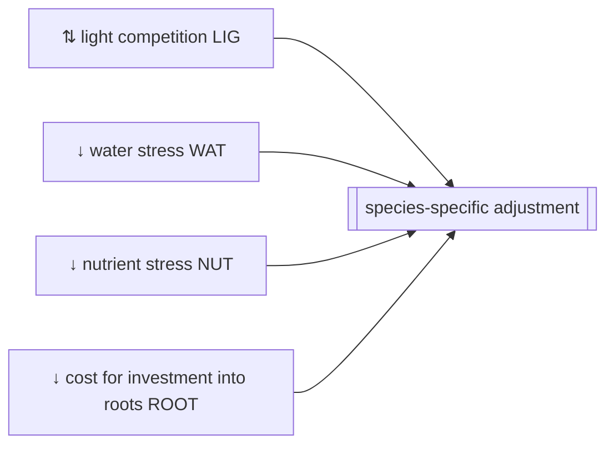

```@meta
CurrentModule=GrasslandTraitSim
```

# Species-specific growth adjustment - Overview

Click on a process to view detailed documentation:


```mermaid
flowchart LR
    F[⇅ light competition LIG] --> C[[species-specific adjustment]]
    H[↓ water stress WAT] -->  C
    I[↓ nutrient stress NUT] --> C
    L[↓ cost for investment into roots ROOT] --> C
click F "growth_species_specific_light" "Go"
click H "growth_species_specific_water" "Go"
click I "growth_species_specific_nutrients" "Go"
click L "growth_species_specific_roots" "Go"
```
