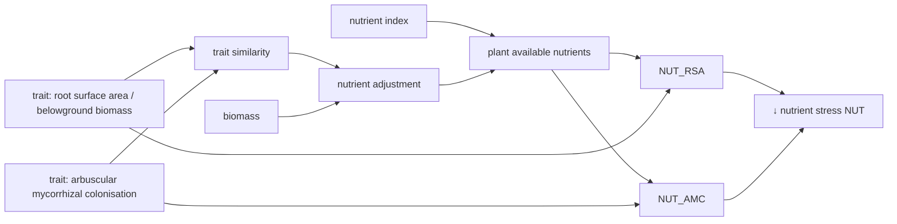

```@meta
CurrentModule=GrasslandTraitSim
```

# Species-specific growth adjustment - Nutrients


```@raw html
<script setup>
    import { onMounted } from 'vue';
    import { nutrientAdjustmentPlot, nutrientStressRSAPlot, nutrientStressAMCPlot } from './d3_plots/NutrientStress.js';
    onMounted(() => { 
        nutrientAdjustmentPlot();
        nutrientStressRSAPlot();
        nutrientStressAMCPlot();
    });
</script>
```



The nutrient stress growth reducer ``NUT_{txys}`` [-] is defined as:

```math
NUT_{txys} = \max(NUT_{AMC, txys},\,NUT_{RSA, txys})
```

The growth reducers based on arbuscular mycorrhizal colonisation rate ``NUT_{AMC, txys}`` and the root surface area ``NUT_{RSA, txys}`` are described [below](@ref "Growth reducers"). The maximum of both response curves is used for the nutrient reduction function. It is assumed that the plants needs either many fine roots per above ground biomass or have a strong symbiosis with mycorrhizal fungi. Both functions use the calculation of the [plant available nutrients](@ref "Plant available nutrients").

## Growth reducers

- the nutrient stress growth reducer based on the arbuscular mycorrhizal colonisation rate ``NUT_{AMC,txys}`` [-] is defined as:

```math
\begin{align}
    NUT_{AMC,txys} &= 
    \begin{cases}
        0 & \text{if } R = 0 \\
        1 / \left(1 + \exp\left(-\beta_{N,AMC}\cdot \left(N_{p, txys} - x_{0, N,AMC} \right)\right)\right) & \text{if } 0 < R < 1 \\
        1 & \text{if } R >= 1 \\
    \end{cases}  \\
   x_{0, N,AMC} &= \frac{1}{\beta_{N,AMC}} \cdot  \left(-\delta_{N,AMC}\cdot \left(TAMC_{txys} - \left(\frac{1}{\delta_{N,AMC}} \cdot \log\left(\frac{1 - \alpha_{N,AMC,05}}{\alpha_{N,AMC,05}}\right) + \phi_{AMC}\right)\right)\right) + 0.5  \\
    TAMC_{txys} &= \frac{B_{B, txys}}{B_{txys}} \cdot  AMC_s  
\end{align}
```

- the nutrient stress growth reducer based on the root surface area ``NUT_{RSA,txys}`` [-] is defined as:

```math
\begin{align}
    NUT_{RSA,txys} &= 
    \begin{cases}
        0 & \text{if } R = 0 \\
        1 / \left(1 + \exp\left(-\beta_{N,RSA}\cdot \left(N_{p, txys} - x_{0, N,RSA} \right)\right)\right) & \text{if } 0 < R < 1 \\
        1 & \text{if } R >= 1 \\
    \end{cases}  \\
   x_{0, N,RSA} &= \frac{1}{\beta_{N,RSA}} \cdot  \left(-\delta_{N,RSA}\cdot \left(TRSA_{txys} - \left(\frac{1}{\delta_{N,RSA}} \cdot \log\left(\frac{1 - \alpha_{N,RSA, 05}}{\alpha_{N,RSA, 05}}\right) + \phi_{RSA}\right)\right)\right) + 0.5  \\
    TRSA_{txys} &= \frac{B_{B, txys}}{B_{txys}} \cdot  RSA_s 
\end{align}
```

:::tabs

== Parameter

- ``\phi_{AMC}`` reference trait value [-]
- ``\beta_{N,AMC}`` slope of response function [-]
- ``\alpha_{N,AMC,05}`` response at ``N_{p, txys} = 0.5`` for species with the reference trait value [-]
- ``\delta_{N,AMC}`` scales the difference in the growth reducer between species [-]
- ``\phi_{RSA}`` reference trait value [m² g⁻¹]
- ``\beta_{N,RSA}`` slope of response function [-]
- ``\alpha_{N,RSA,05}`` response at ``N_{p, txys} = 0.5`` for species with the reference trait value [-]
- ``\delta_{N,RSA}`` scales the difference in the growth reducer between species [g m⁻²]
see also [`SimulationParameter`](@ref)

== Variables

state variables:
- ``B_{B, txys}`` belowground biomass of each species [kg ha⁻¹]
- ``B_{txys}`` biomass of each species [kg ha⁻¹]

intermediate variables:
- ``TRSA_{txys}`` root surface area per total biomass of each species [m² g⁻¹] 
- ``TAMC_{txys}`` arbuscular mycorrhizal colonisation rate per total biomass of each species [-] 
- ``N_{p, txy}`` plant available nutrients, see [next section](@ref "Plant available nutrients") [-]

morphological traits:
- ``RSA_s`` root surface area per belowground biomass of each species [m² g⁻¹]
- ``AMC_s`` arbuscular mycorrhizal colonisation rate [-]

:::

### Visualization

- growth reducer based on root surface area per total biomass:
```@raw html
<table>
    <colgroup>
       <col>
       <col width="80px">
       <col>
    </colgroup>
    <tbody>
    <tr>
        <td>response at Np = 0.5 for species with the reference trait value (α_NRSA05)<br>(strong to weak growth reduction)</td>
        <td><span id="ɑ_RSA_05-value">0.9</span></td>
        <td><input type="range" id="ɑ_RSA_05" min="0.1" max="0.999" step="0.001" value="0.9" class="input_nutrient_rsa_graph"></td>
    </tr>
    <tr>
        <td>difference between species (δ_NUT_rsa) <br>(no to strong difference)</td>
        <td><span id="δ_RSA-value">10</span></td>
        <td><input type="range" id="δ_RSA" min="0.1" max="25.0" step="0.1" value="10" class="input_nutrient_rsa_graph"></td>
    </tr>
    <tr>
        <td>slope of response (β_NUT_rsa)</td>
        <td><span id="β_RSA-value">7</span></td>
        <td><input type="range" id="β_RSA" min="3" max="10" step="0.1" value="7" class="input_nutrient_rsa_graph"></td>
    </tr>
    <tr>
        <td>reference trait value (ϕ_TRSA)</td>
        <td><span id="phi_RSA-value">0.15</span></td>
        <td><input type="range" id="phi_RSA" min="0.05" max="0.25" step="0.05" value="0.15" class="input_nutrient_rsa_graph"></td>
    </tr>
    </tbody>
</table>

<svg id="nutrient_rsa_graph"></svg>
```

- growth reducer based on arbuscular mycorrhizal colonisation rate per total biomass:
```@raw html
<table>
    <colgroup>
       <col>
       <col width="80px">
       <col>
    </colgroup>
    <tbody>
        <tr>
            <td>response at Np = 0.5 for species with the reference trait value (α_NAMC05)<br>(strong to weak growth reduction)</td>
            <td><span id="ɑ_AMC_05-value">0.9</span></td>
            <td><input type="range" id="ɑ_AMC_05" min="0.1" max="0.999" step="0.001" value="0.9" class="input_nutrient_amc_graph"></td>
        </tr>
        <tr>
            <td>difference between species (δ_NUT_amc) <br>(no to strong difference)</td>
            <td><span id="δ_AMC-value">10</span></td>
            <td><input type="range" id="δ_AMC" min="0.1" max="15.0" step="0.1" value="8" class="input_nutrient_amc_graph"></td>
        </tr>
        <tr>
            <td>slope of response (β_NUT_amc)</td>
            <td><span id="β_AMC-value">7</span></td>
            <td><input type="range" id="β_AMC" min="3" max="10" step="0.1" value="7" class="input_nutrient_amc_graph"></td>
        </tr>
        <tr>
            <td>reference trait value (ϕ_TAMC)</td>
            <td><span id="phi_AMC-value">0.2</span></td>
            <td><input type="range" id="phi_AMC" min="0.0" max="0.4" step="0.1" value="0.2" class="input_nutrient_amc_graph"></td>
        </tr>
    </tbody>
</table>

<svg id="nutrient_amc_graph"></svg>
```

### API
```@docs
nutrient_reduction!
```

## Plant available nutrients

The plant available nutrients ``N_{p, txys}`` [-] are descriped by:

```math
\begin{align}
    N_{p, txys} &= \frac{N_{xy}}{N_{\max}} \cdot D_{txys} \\
    D_{txys} &= D_{\max} \cdot \exp\left(\frac{\log\left(\frac{1}{D_{\max}}\right) \cdot \sum_{i=1}^{S} TS_{s,i} \cdot B_{txyi}}{\alpha_{TSB}} \right) \\
    \mathbf{TS} &= 
        \begin{bmatrix}
            1 & TS_{1,2} & \dots &  & TS_{1,S} \\
            TS_{2,1} & 1 &  & \\
            \vdots &  & \ddots &  & \\
            TS_{S,1} & & & & 1 \\
        \end{bmatrix} \\
    \mathbf{TS} &= 1 - \frac{\mathbf{TD}}{\max(\mathbf{TD})} \\
    TD_{s,i} &= \sqrt{\left(RSA_{norm, s} - RSA_{norm, i}\right)^2 + \left( AMC_{norm, s} - AMC_{norm, i}\right)^2} \\
    RSA_{\text{norm}, s} &= \frac{RSA_s - \text{mean}(RSA)}{\text{sd}(RSA)} \\
    AMC_{\text{norm}, s} &= \frac{AMC_s - \text{mean}(AMC)}{\text{sd}(AMC)} \\
\end{align}
```


:::tabs

== Parameter

- ``N_{\max}`` maximum total soil nitrogen [g kg⁻¹]
- ``D_{\max}`` maximum nutrient adjustment factor [-]
- ``\alpha_{TSB}`` reference value, at ``\alpha_{TSB} = TS_{s,i} \cdot B_{txyi}`` is the nutrient adjustment factor ``D_{txys} = 1`` [kg ha⁻¹]
see also [`SimulationParameter`](@ref)

== Variables

inputs:
- ``N_{xy}`` total soil nitrogen [g kg⁻¹]

state variables:
- ``B_{txys}`` biomass of each species [kg ha⁻¹]

intermediate variables:
- ``D_{txys}`` density dependent nutrient adjustment factor [-]
- ``TS_{s,i} \in [0, 1]`` trait similarity 
- ``TD_{s,i}`` trait dissimilarity 
- ``RSA_{\text{norm}, s}`` normalized root surface area per belowground biomass [-]
- ``AMC_{\text{norm}, s}`` normalized arbuscular mycorrhizal colonisation rate [-]

morphological traits:
- ``RSA_s`` root surface area per belowground biomass of each species [m² g⁻¹]
- ``AMC_s`` arbuscular mycorrhizal colonisation rate [-]

:::

### Visualization
```@raw html
<table>
    <colgroup>
       <col>
       <col width="80px">
       <col>
    </colgroup>
    <tbody>
    <tr>
        <td>maximum nutrient adjustment factor (Dₘₐₓ)</td>
        <td><span id="D_max-value">4.0</span></td>
        <td><input type="range" id="D_max" min="1.0" max="10.0" step="0.1" value="4.0" class="nutrient_adjustment_graph_graph"></td>
    </tr>
    <tr>
        <td>reference value for ∑ TS ⋅ B (α_TSB)</td>
        <td><span id="α_TSB-value">10000</span></td>
        <td><input type="range" id="α_TSB" min="5000" max="40000" step="500" value="10000" class="nutrient_adjustment_graph_graph"></td>
    </tr>
    </tbody>
</table>
<svg width="600" height="400" id="nutrient_adjustment_graph"></svg>
```

### API
```@docs
similarity_matrix!
nutrient_competition!
input_nutrients!
```