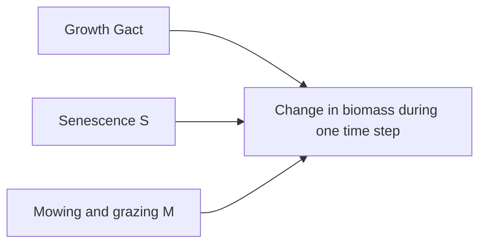

# Plant biomass dynamics

Click on a process to view detailed documentation:



The change in the biomass ``B`` from day ``t`` to ``t+1`` of species ``s`` in patch ``x,y`` [kg ha⁻¹] is calculated based on the actual growth ``G_{act, txys}`` [kg ha⁻¹], and the losses by senescence ``S_{txys}`` [kg ha⁻¹] and management ``M_{txys}`` [kg ha⁻¹]: 
```math
B_{t+1xys} = B_{txys} + G_{act, txys} - S_{txys} - M_{txys}
```