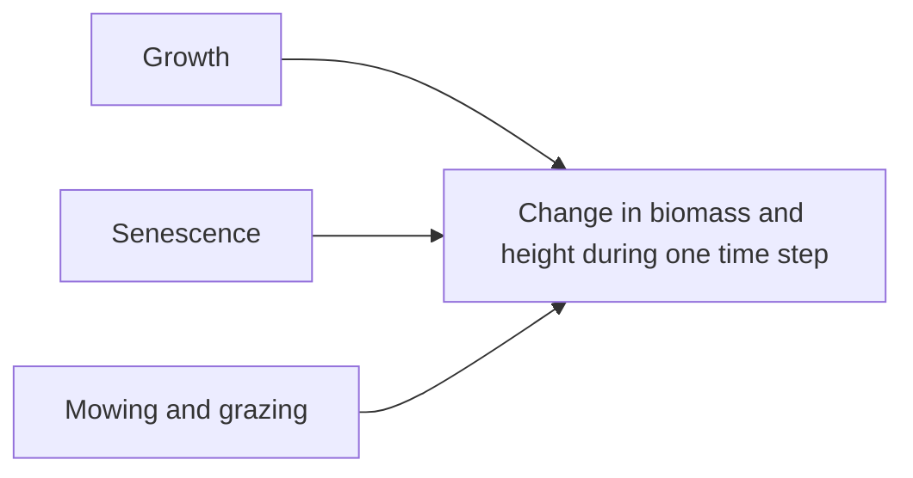

# Plant biomass dynamics

Click on a process to view detailed documentation:

```mermaid
flowchart LR
    A[Growth] --> B[Change in biomass and height during one time step]
    C[Senescence] --> B
    D[Mowing and grazing] --> B

click C "senescence" "Go"
click A "growth" "Go"
click D "mowing_grazing" "Go"
```
