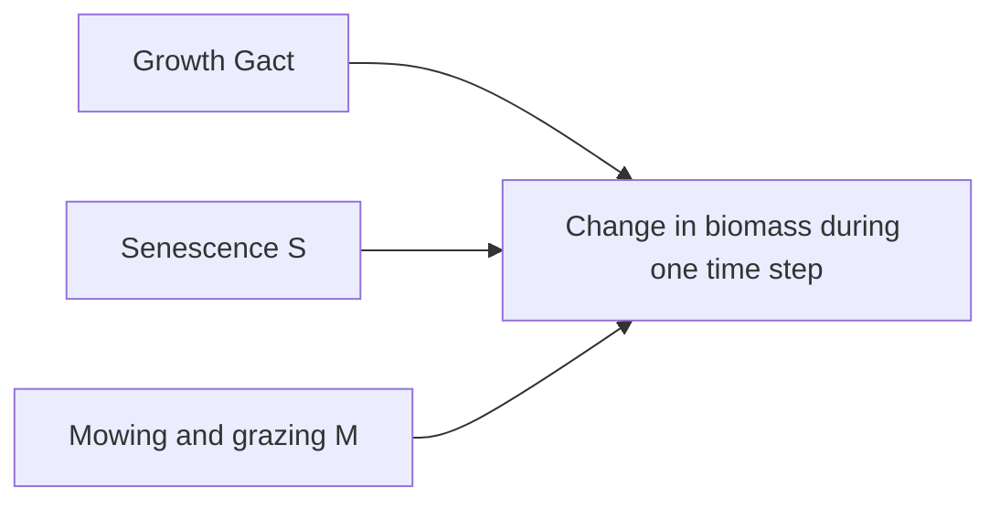

# Plant biomass dynamics

Click on a process to view detailed documentation:



The change in the biomass ``B`` from day ``t`` to ``t+1`` of species ``s`` in patch ``x,y`` [kg ha⁻¹] is calculated based on the actual growth ``G_{act, ts}`` [kg ha⁻¹], and the losses by senescence ``S_{ts}`` [kg ha⁻¹] and management ``M_{ts}`` [kg ha⁻¹]: 
```math
B_{t+1s} = B_{ts} + G_{act, ts} - S_{ts} - M_{ts}
```

The change in the total biomass ``B_{ts}`` is divided into the change in above-ground ``B_{A,ts}`` [kg ha⁻¹] and below-ground biomass ``B_{ts}`` [kg ha⁻¹]. We assume that plants aim to achieve a similar level of above-ground biomass per total biomass similar to the time-invariant trait above-ground biomass per total biomass ``abp_s`` [-]. We therefore calculate ``A_{ts}`` [-] the ratio between the actual biomass ratio and the trait ``abp_s``:
```math
A_{ts} = \frac{\left(\frac{B_{A,ts}}{B_{ts}}\right)}{abp_s}
```

``A_{ts}`` is less than one if the above-ground biomass per total biomass is less than expected by the trait ``abp_s``, for example after a mowing event. This variable can be used to allocate biomass changes by growth and senescence to above-ground and below-ground biomass. Biomass loss by mowing and grazing affects only the above-ground biomass:
```math
\begin{align}
    B_{A, t+1s} &= B_{A, ts} + A_{ts} \cdot G_{act, ts} -  (1 - A_{ts}) \cdot S_{ts} - M_{ts} \\
    B_{B, t+1s} &= B_{B, ts} + (1 - A_{ts}) \cdot G_{act, ts} - A_{ts} \cdot S_{ts} 
\end{align}
```