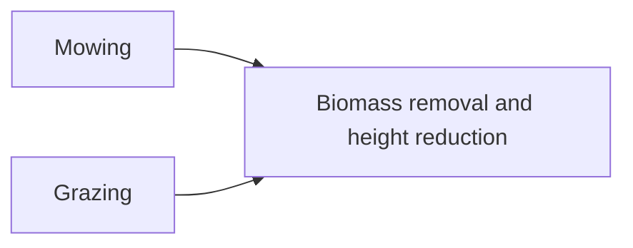

```@meta
CurrentModule=GrasslandTraitSim
```

# Mowing and grazing



## Mowing
### Visualization
### API
```@docs
mowing!
```

## Grazing

equation partly based on [Moulin2021](@cite)

### Visualization
```@raw html
<script setup>
    import { onMounted } from 'vue';
    import { grazingPlot } from './d3_plots/Grazing.js';
    onMounted(() => { grazingPlot() });
</script>

<table>
    <colgroup>
        <col>
        <col width="80px">
        <col>
    </colgroup>
    <tbody>
    <tr>
        <td>controls the start of supplementary feeding or the reduction of the livestock density (η_GRZ)</td>
        <td><span id="η_GRZ-value">2</span></td>
        <td><input type="range" min="0.1" max="10" step="0.1" value="2" id="η_GRZ"></td>
    </tr>
    <tr>
        <td>Livestock Density (LD)</td>
        <td><span id="LD-value">3</span></td>
        <td><input type="range" min="0.1" max="4.5" step="0.1" value="3" id="LD" class="slider"></td>
    </tr>
    <tr>
        <td>Maximum consumption per livestock and day (κ)</td>
        <td><span id="κ-value">22</span></td>
        <td><input type="range" min="12" max="25" step="1" value="22" id="κ"></td>
    </tr>
    </tbody>
</table>

<svg width="600" height="400" id="grazing_graph"></svg> 
```

### API
```@docs
grazing!
```