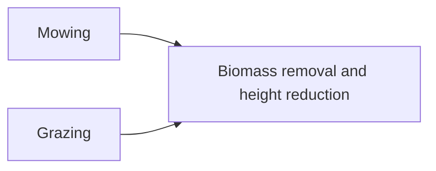

```@meta
CurrentModule=GrasslandTraitSim
```

# Mowing and grazing



Biomass losses due to management ``M_{txys}`` [kg ha⁻¹] are caused by mowing ``MOW_{txys}`` [kg ha⁻¹] and grazing ``GRZ_{txys}`` [kg ha⁻¹]:
```math
M_{txys} = MOW_{txys} + GRZ_{txys}
```

## Mowing

The mown biomass ``MOW_{txys}`` [kg ha⁻¹] is decribed by:
```math
MOW_{txys} =  \frac{\max\left(H_{txys} - CUT_{txy},\,0\,\text{m}\right)}{H_{txys}} \cdot B_{A, txys}
```

:::tabs

== Parameter

none

== Variables

inputs:
- ``CUT_{txy}`` cutting height of a mowing event [m]

state variables:
- ``B_{A, txys}`` aboveground biomass of each species [kg ha⁻¹]
- ``H_{txys}`` plant height of each species [m]

:::

### API
```@docs
mowing!
```

## Grazing

The grazed biomass ``GRZ_{txys}`` [kg ha⁻¹] is defined as:
```math
\begin{align}
GRZ_{txys} &=
    \frac{\kappa \cdot LD_{txy} \cdot (B_{F, txy})^{2}}{(\kappa \cdot LD_{txy} \cdot \eta_{GRZ})^2 + (B_{F, txy})^2} \cdot
    \frac{PAL_{txys}\cdot H_{GRZ,txys} \cdot B_{F, txys}}{\sum_{i=1}^{S}PAL_{txyi} \cdot H_{GRZ,txyi} \cdot B_{F, txyi}  } \\
B_{F, txys} &= \max\left(1 - \frac{\eta_{GRZ,H}}{H_{txys}},\,0\right) \cdot B_{A, txys} \\
B_{F, txy} &= \sum_{s=1}^{S} B_{F, txys} \\
PAL_{txys} &= \left(\frac{LNC_s}{LNC_{cwm, txy}}\right) ^ {\beta_{PAL, lnc}} \\
LNC_{cwm, txy} &= \sum_{s=1}^{S} \frac{B_{F, txys}}{B_{F,txy}} \cdot LNC_s \\
H_{GRZ,txys} &= \left(\frac{H_{txys}}{H_{cwm,txy}} \right) ^ {\beta_{GRZ, H}} \\
H_{cwm,txy} &= \sum_{s=1}^{S} \frac{B_{F, txys}}{B_{F,txy}} \cdot H_{txys}
\end{align}
```

The equation is partly based on [Moulin2021](@cite).

:::tabs

== Parameter

- ``\kappa`` maximum consumption of biomass per livestock and day [kg ha⁻¹]
- ``\eta_{GRZ}`` controls when the farmer starts to supply additional fooder [-]
- ``\eta_{GRZ,H}`` plant parts below this height are not accessible to grazers. [m] 
- ``\beta_{PAL, lnc}`` scales the influence of the leaf nitrogen content on the preference of the grazers [-]
- ``\beta_{GRZ, H}`` scales the influence of the height on the preference of the grazers [-]

== Variables

inputs:
- ``LD_{txy}`` livestock density [-]

state variables:
- ``B_{A, txys}`` aboveground biomass of each species [kg ha⁻¹]
- ``H_{txys}`` plant height of each species [m]

intermediate variables:
- ``B_{F, txys}`` biomass that can be fed by grazers of each species [kg ha⁻¹]
- ``B_{F, txy}`` total biomass that can be fed by grazers [kg ha⁻¹]
- ``PAL_{txys}`` scaled influence of leaf nitrogen content ("palatability") on the gazer preference [-]
- ``H_{GRZ,txys}`` scaled influence of plant height on the gazer preference [-]
- ``LNC_{cwm,txy}`` community weighted mean leaf nitrogen content [mg g⁻¹]
- ``H_{cwm,txy}`` community weighted mean height [m]


morphological traits:
- ``LNC_s`` leaf nitrogent content of each species [mg g⁻¹]

:::


### Visualization
```@raw html
<script setup>
    import { onMounted } from 'vue';
    import { grazingPlot } from './d3_plots/Grazing.js';
    onMounted(() => { grazingPlot() });
</script>

<table>
    <colgroup>
        <col>
        <col width="80px">
        <col>
    </colgroup>
    <tbody>
    <tr>
        <td>controls when the farmer starts to supply additional fooder (η_GRZ)</td>
        <td><span id="η_GRZ-value">2</span></td>
        <td><input type="range" min="0.1" max="10" step="0.1" value="2" id="η_GRZ"></td>
    </tr>
    <tr>
        <td>Livestock Density (LD)</td>
        <td><span id="LD-value">3</span></td>
        <td><input type="range" min="0.1" max="4.5" step="0.1" value="3" id="LD" class="slider"></td>
    </tr>
    <tr>
        <td>Maximum consumption per livestock and day (κ)</td>
        <td><span id="κ-value">22</span></td>
        <td><input type="range" min="12" max="25" step="1" value="22" id="κ"></td>
    </tr>
    </tbody>
</table>

<svg width="600" height="400" id="grazing_graph"></svg> 
```

### API
```@docs
grazing!
```