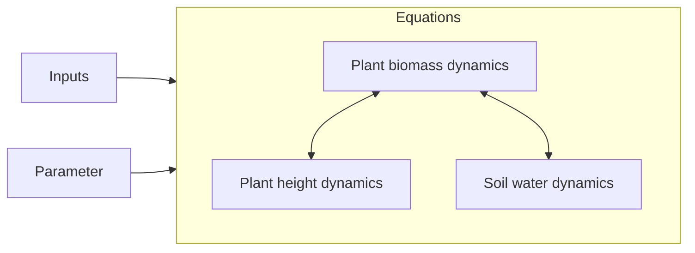

```@meta
CurrentModule=GrasslandTraitSim
```

# Model description overview

Click on the links to view detailed documentation:



On this site you can find a rather technical overview of the procedure.

## Solve the difference equation

The main function to solve the difference equations and get the solution is [`solve_prob`](@ref).

### API

```@docs
solve_prob
```

## Initialization

The initial conditions of the state variables are set. Each plant species
gets an equal share of the initial biomass. The height is set to half of the
maximum height of the species. The above- and belowground biomass
are calculated based on the aboveground biomass proportion ``abp_s``.

Traits can be either specified manually, or they will be generated with a 
bivariate Gaussian mixture model with full covariance matrices. For each species
either the first or the second Gaussian distribution is used to generate 
the log/logit-transformed traits. The traits are then backtransformed
to the original scale and the units are added. If the proportion of the leaf mass
of the total plant mass ``lbp_s`` is larger than 0.95 % of the proportion of the
aboveground mass of the total mass ``abp_s``, ``lbp_s`` is set to 0.95 % of ``abp_s``. 
The Gaussian mixture model was fitted to the data with the function
`BayesianGaussianMixture` of [scikit-learn](@cite) to a set of grassland species
that was found in Germany in the Biodiversity Exploratories. Here, you can get an 
overview of the transformation of the traits:

| trait           | description                                        | transformation |
| --------------- | -------------------------------------------------- | -------------- |
| ``sla_s``       | specific leaf area [m² g⁻¹]                        | log            |
| ``maxheight_s`` | potential plant height [m]                         | log            |
| ``lnc_s``       | leaf nitrogen content per leaf dry mass [mg g⁻¹]   | log            |
| ``rsa_s``       | root surface area per belowground biomass [m² g⁻¹] | log            |
| ``amc_s``       | arbuscular mycorrhizal colonisation rate [-]       | logit          |
| ``abp_s``       | aboveground dry mass per plant dry mass [-]        | logit          |
| ``lbp_s``       | leaf dry mass per plant dry mass [-]               | logit          |

### API
```@docs
initialization
set_initialconditions!
random_traits!
```

## Main loop

For each time step the function [`one_day!`](@ref) is executed and called from [`main_loop!`](@ref).

### API
```@docs	
main_loop!
one_day!
```
