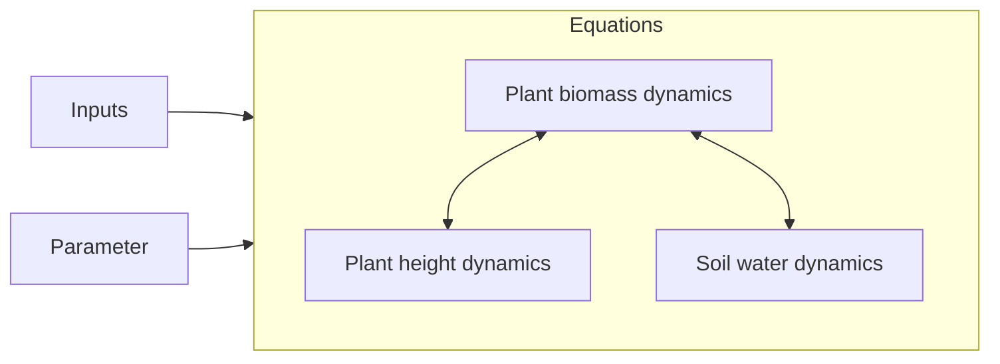

```@meta
CurrentModule=GrasslandTraitSim
```

# Model description overview

Click on the links to view detailed documentation:



On this site you can find a rather technical overview of the procedure.

## Solve the difference equation

The main function to solve the difference equations and get the solution is [`solve_prob`](@ref).

### API

```@docs
solve_prob
```

## Initialization

The initial conditions of the state variables are set.

### API
```@docs
initialization
set_initialconditions!
```

## Main loop

For each time step the function [`one_day!`](@ref) is executed and called from [`main_loop!`](@ref).

### API
```@docs	
main_loop!
one_day!
```
