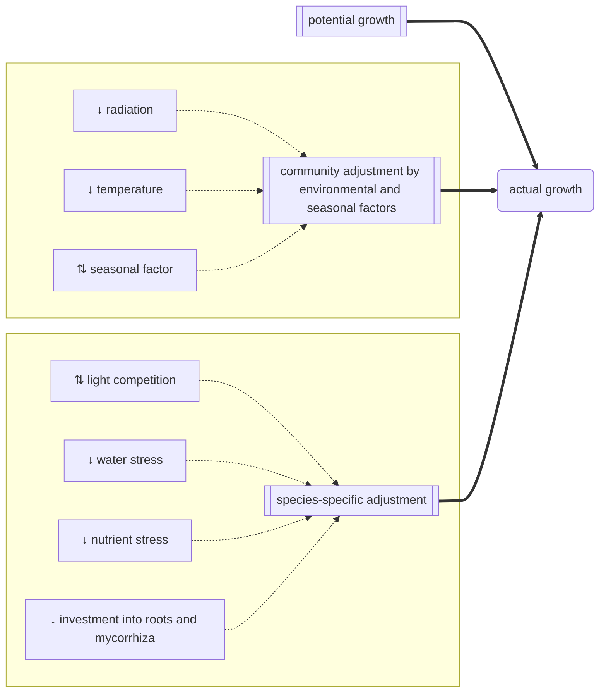

```@meta
CurrentModule=GrasslandTraitSim
```

# Growth

Click on a process to view detailed documentation:


```mermaid
flowchart LR
    A[[potential growth]] ==> D(actual growth)
    B[[community adjustment by environmental and seasonal factors]] ==> D
    C[[species-specific adjustment]] ==> D
    subgraph " "
    L[↓ radiation] -.-> B
    M[↓ temperature] -.-> B
    N[⇅ seasonal factor] -.-> B
    end
    subgraph " "
    F[⇅ light competition] -.-> C
    H[↓ water stress] -.-> C
    I[↓ nutrient stress] -.-> C
    P[↓ investment into roots and mycorrhiza] -.-> C
    end
click A "growth_potential_growth" "Go"
click B "growth_env_factors" "Go"
click C "growth_species_specific" "Go"
click L "growth_env_factors#Radiation-influence" "Go"
click M "growth_env_factors#Temperature-influence" "Go"
click N "growth_env_factors#Seasonal-effect" "Go"
click F "growth_species_specific#Light-competition" "Go"
click H "growth_species_specific#Water-stress" "Go"
click I "growth_species_specific#Nutrient-stress" "Go"
click P "growth_species_specific#Cost-for-investment-into-roots-and-mycorrhiza" "Go"
```

```@docs
growth!
```
