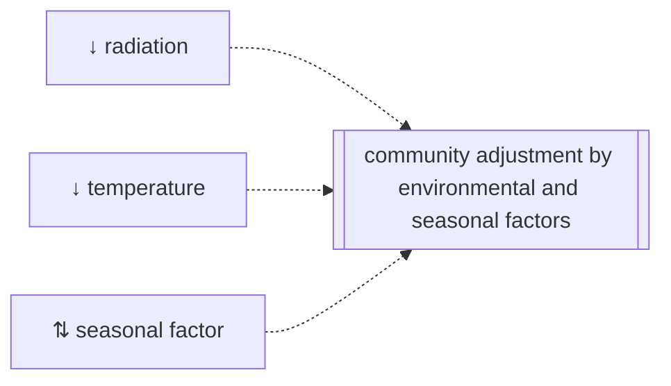

```@meta
CurrentModule=GrasslandTraitSim
```

# Community growth adjustment by environmental and seasonal factors

The functions limit the growth of all plant species without any species-specific reduction:


## Radiation influence
### Visualization
### API
```@docs
radiation_reduction!
```

## Temperature influence
### Visualization
### API
```@docs
temperature_reduction!
```

## Seasonal effect
a seasonal effect, that is modelled by the accumulated degree days

### Visualization
### API

```@docs
seasonal_reduction!
```