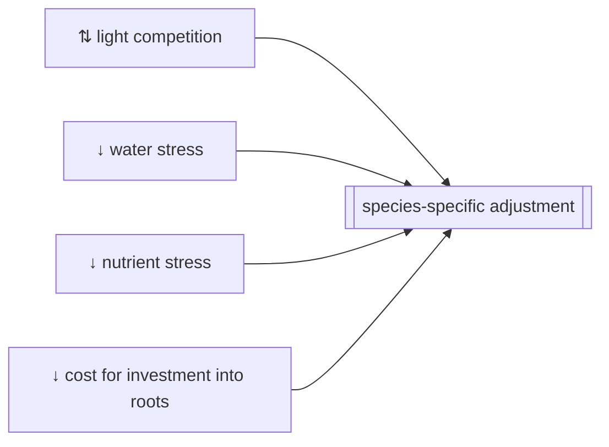
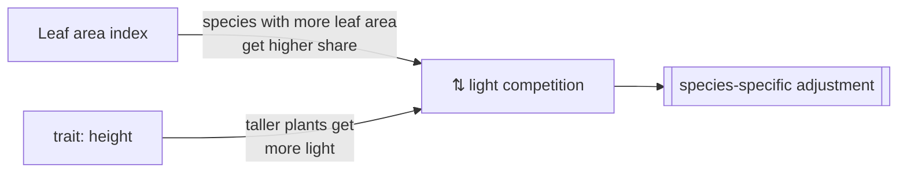
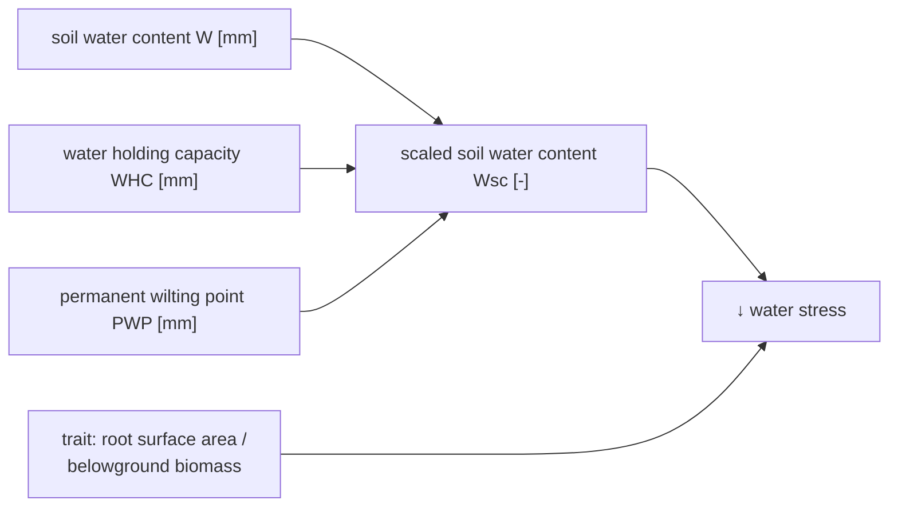
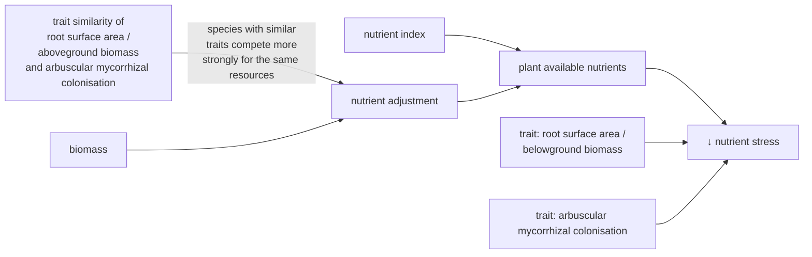

```@meta
CurrentModule=GrasslandTraitSim
```

# Species-specific growth adjustment

```@raw html
<script setup>
    import { onMounted } from 'vue';
    import { waterStressPlot } from './d3_plots/WaterStress.js';
    import { nutrientAdjustmentPlot, nutrientStressRSAPlot, nutrientStressAMCPlot } from './d3_plots/NutrientStress.js';
    import { rootCostsPlot } from './d3_plots/RootCosts.js';
    
    onMounted(() => { 
        waterStressPlot();
        nutrientAdjustmentPlot();
        nutrientStressRSAPlot();
        nutrientStressAMCPlot();
        rootCostsPlot();
    });
</script>
```

## Overview


## Light competition



```@docs	
light_competition!
```

----
## Water stress



The species differ in their response to water stress by the different trait values of the specific leaf area and the root surface areas per above ground biomass. The values of both response functions are multiplied to get factor that reduces the growth. 

It is implemented in [`water_reduction!`](@ref).

```@raw html
<table>
    <colgroup>
        <col>
        <col width="80px">
        <col>
    </colgroup>
    <tbody>
    <tr>
        <td>mean response at \(W_{sc} = 0.5\) \(\;\alpha_{wrsa,05}\;\)<br>see red dot (strong to weak growth reduction)</td>
        <td><span id="ɑ_R_05-value">0.9</span></td>
        <td><input type="range" id="ɑ_R_05" min="0.1" max="0.999" step="0.001" value="0.9" class="input_water_stress_graph"></td>
    </tr>
    <tr>
        <td>difference between species \(\;\delta_{wrsa}\;\) <br>(no to strong difference)</td>
        <td><span id="δ_R-value">10</span></td>
        <td><input type="range" id="δ_R" min="0.1" max="25.0" step="0.1" value="10" class="input_water_stress_graph"></td>
    </tr>
    <tr>
        <td>slope of response  \(\beta_{wrsa}\)</td>
        <td><span id="β_R-value">7</span></td>
        <td><input type="range" id="β_R" min="3" max="10" step="0.1" value="7" class="input_water_stress_graph"></td>
    </tr>
    </tbody>
</table>

<svg width="600" height="400" id="water_stress_graph"></svg>
```

```@docs
water_reduction!
```

## Nutrient stress



### [Nutrient competition factor](@id below_competition)

```@raw html
<table>
    <colgroup>
       <col>
       <col width="80px">
       <col>
    </colgroup>
    <tbody>
    <tr>
        <td>TSBmax</td>
        <td><span id="TSB_max-value">10000</span></td>
        <td><input type="range" id="TSB_max" min="5000" max="40000" step="500" value="10000" class="nutrient_adjustment_graph_graph"></td>
    </tr>
    <tr>
        <td>nutadj_max</td>
        <td><span id="nutadj_max-value">4.0</span></td>
        <td><input type="range" id="nutadj_max" min="1.0" max="5.0" step="0.1" value="4.0" class="nutrient_adjustment_graph_graph"></td>
    </tr>
    </tbody>
</table>

<svg width="600" height="400" id="nutrient_adjustment_graph"></svg>
```

```@docs
below_ground_competition!
```

### Growth reduction due to nutrient stress
The species differ in the response to nutrient availability by different proportion of mycorrhizal colonisations and root surface per above ground biomass. The maximum of both response curves is used for the nutrient reduction function. It is assumed that the plants needs either many fine roots per above ground biomass or have a strong symbiosis with mycorrhizal fungi. 

It is implemented in [`nutrient_reduction!`](@ref).


```@raw html
<table>
    <colgroup>
       <col>
       <col width="80px">
       <col>
    </colgroup>
    <tbody>
    <tr>
        <td>mean response at \(N_p = 0.5\) \(\;\alpha_{nrsa,05}\;\)<br>see red dot (strong to weak growth reduction)</td>
        <td><span id="ɑ_RSA_05-value">0.9</span></td>
        <td><input type="range" id="ɑ_RSA_05" min="0.1" max="0.999" step="0.001" value="0.9" class="input_nutrient_rsa_graph"></td>
    </tr>
    <tr>
        <td>difference between species \(\;\delta_{nrsa}\;\) <br>(no to strong difference)</td>
        <td><span id="δ_RSA-value">10</span></td>
        <td><input type="range" id="δ_RSA" min="0.1" max="25.0" step="0.1" value="10" class="input_nutrient_rsa_graph"></td>
    </tr>
    <tr>
        <td>slope of response  \(\beta_{nrsa}\)</td>
        <td><span id="β_RSA-value">7</span></td>
        <td><input type="range" id="β_RSA" min="3" max="10" step="0.1" value="7" class="input_nutrient_rsa_graph"></td>
    </tr>
    </tbody>
</table>

<svg width="600" height="400" id="nutrient_rsa_graph"></svg>
```

```@raw html
<table>
    <colgroup>
       <col>
       <col width="80px">
       <col>
    </colgroup>
    <tbody>
        <tr>
            <td>mean response at \(N_p = 0.5\) \(\;\alpha_{namc,05}\;\)<br>see red dot (strong to weak growth reduction)</td>
            <td><span id="ɑ_AMC_05-value">0.9</span></td>
            <td><input type="range" id="ɑ_AMC_05" min="0.1" max="0.999" step="0.001" value="0.9" class="input_nutrient_amc_graph"></td>
        </tr>
        <tr>
            <td>difference between species \(\;\delta_{namc}\;\) <br>(no to strong difference)</td>
            <td><span id="δ_AMC-value">10</span></td>
            <td><input type="range" id="δ_AMC" min="0.1" max="15.0" step="0.1" value="8" class="input_nutrient_amc_graph"></td>
        </tr>
        <tr>
            <td>slope of response  \(\beta_{namc}\)</td>
            <td><span id="β_AMC-value">7</span></td>
            <td><input type="range" id="β_AMC" min="3" max="10" step="0.1" value="7" class="input_nutrient_amc_graph"></td>
        </tr>
    </tbody>
</table>

<svg width="600" height="400" id="nutrient_amc_graph"></svg>
```

```@docs
nutrient_reduction!
```

## Cost for investment into roots and mycorrhiza


```@raw html
<table>
    <colgroup>
       <col>
       <col width="80px">
       <col>
    </colgroup>
    <tbody>
    <tr>
        <td>κ_maxred_amc</td>
        <td><span id="κ_maxred_amc-value">0.2</span></td>
        <td><input type="range" id="κ_maxred_amc" min="0.0" max="1" step="0.01" value="0.2" class="input_root_cost_graph"></td>
    </tr>
    <tr>
        <td>ϕ_amc</td>
        <td><span id="ϕ_amc-value">0.2</span></td>
        <td><input type="range" id="ϕ_amc" min="0.1" max="0.5" step="0.05" value="0.2" class="input_root_cost_graph"></td>
    </tr>
    </tbody>
</table>

<svg width="600" height="400" id="root_cost_graph"></svg>
```

```@docs	
root_investment!
```
