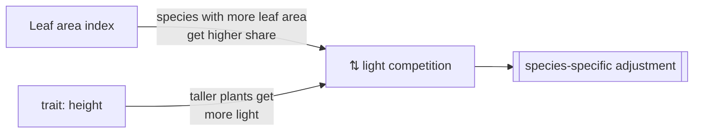

```@meta
CurrentModule=GrasslandTraitSim
```

# Species-specific growth adjustment - Light


```mermaid
flowchart LR
    L[Leaf area index] -->|species with more leaf area\nget higher share| F
    K[trait: height] -->|taller plants get\nmore light| F
    F[⇅ light competition] --> C[[species-specific adjustment]]
```

### Visualization
### API
```@docs	
light_competition!
```