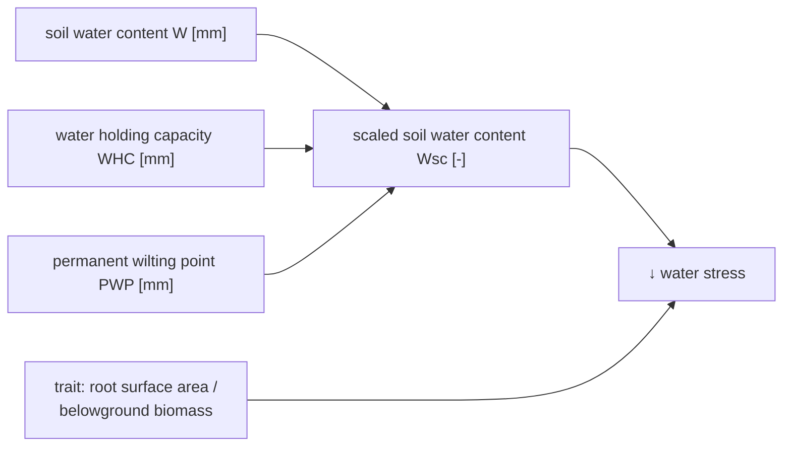

```@meta
CurrentModule=GrasslandTraitSim
```

# Species-specific growth adjustment - Soil water

```@raw html
<script setup>
    import { onMounted } from 'vue';
    import { waterStressPlot } from './d3_plots/WaterStress.js';
    onMounted(() => { waterStressPlot() });
</script>
```



The species differ in their response to water stress by the different trait values of the specific leaf area and the root surface areas per above ground biomass. The values of both response functions are multiplied to get factor that reduces the growth. 

## Visualization
```@raw html
<table>
    <colgroup>
        <col>
        <col width="80px">
        <col>
    </colgroup>
    <tbody>
    <tr>
        <td>mean response at \(W_{sc} = 0.5\) \(\;\alpha_{wrsa,05}\;\)<br>see red dot (strong to weak growth reduction)</td>
        <td><span id="ɑ_R_05-value">0.9</span></td>
        <td><input type="range" id="ɑ_R_05" min="0.1" max="0.999" step="0.001" value="0.9" class="input_water_stress_graph"></td>
    </tr>
    <tr>
        <td>difference between species \(\;\delta_{wrsa}\;\) <br>(no to strong difference)</td>
        <td><span id="δ_R-value">10</span></td>
        <td><input type="range" id="δ_R" min="0.1" max="25.0" step="0.1" value="10" class="input_water_stress_graph"></td>
    </tr>
    <tr>
        <td>slope of response  \(\beta_{wrsa}\)</td>
        <td><span id="β_R-value">7</span></td>
        <td><input type="range" id="β_R" min="3" max="10" step="0.1" value="7" class="input_water_stress_graph"></td>
    </tr>
    </tbody>
</table>

<svg id="water_stress_graph"></svg>
```

## API
```@docs
water_reduction!
```