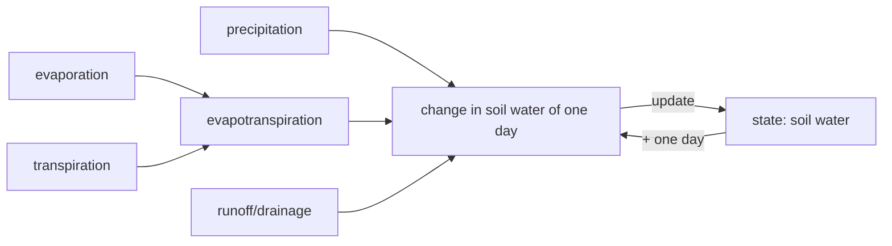

```@meta
CurrentModule=GrasslandTraitSim
```

# Water dynamics


```mermaid
flowchart LR
    A[precipitation] --> B[change in soil water of one day]
    C[evapotranspiration] --> B
    J[evaporation] --> C
    L[transpiration] --> C
    D[runoff/drainage] --> B
    B --update--> K[state: soil water]
    K --+ one day--> B
```

```@docs
change_water_reserve
transpiration
evaporation
input_WHC_PWP!
```
