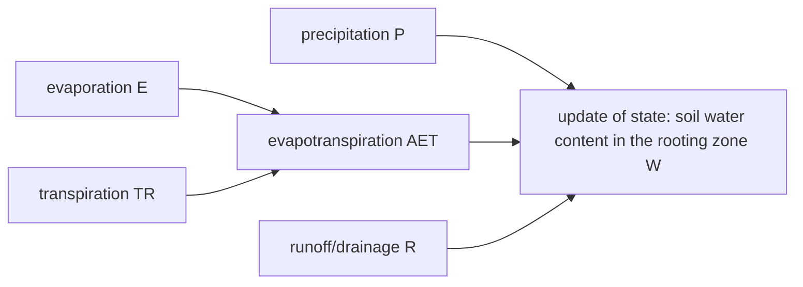

```@meta
CurrentModule=GrasslandTraitSim
```

# Soil water dynamics

```@raw html
<script setup>
    import { onMounted } from 'vue';
    import { WHCPWPPlot } from './plots.js';
    onMounted(() => { WHCPWPPlot(); });
</script>
```




The dynamics of the soil water content in the rooting zone ``W_{txy}`` [mm] is described by:
```math
\begin{align}
W_{t+1xy} &= W_{txy} + P_{txy} - AET_{txy} - R_{txy} \\
AET_{txy} &= \min\left(W_{txy}, E_{txy} + TR_{txy}\right) \\
R_{txy} &= \max\left(0\, \text{mm}, W_{txy} + P_{txy} - AET_{txy} - WHC_{xy}\right) \\
E_{txy} &= \frac{W_{txy}}{WHC_{xy}} \cdot PET_{txy} \cdot \left[1-\min\left(1, \frac{LAI_{tot, txy}}{3}\right)\right] \\
TR_{txy} &= 
    \max\left(0,\,\frac{W_{txy} - PWP_{xy}}{WHC_{xy} - PWP_{xy}}\right) \cdot 
    PET_{txy} \cdot
    \min\left(1, \frac{LAI_{tot, txy}}{3}\right)  \\
LAI_{tot, txy} &= \sum_{s=1}^{S} LAI_{txys} \\
LAI_{txys} &= B_{A, txys} \cdot SLA_s \cdot \frac{LBP_s}{ABP_s} \cdot 0.1
\end{align}
```

Water holding capacity ``WHC_{xy}`` [mm] and permanent wilting point ``PWP_{xy}`` [mm] are derived by:
```math
\begin{align}
WHC_{xy} &= F_{WHC, xy} \cdot RD_{xy} \\
PWP_{xy} &= F_{PWP, xy} \cdot RD_{xy} \\
F_{WHC, xy} &= \beta_{SND, WHC} \cdot SND_{xy} + 
                    \beta_{SLT, WHC} \cdot SLT_{xy} + 
                    \beta_{CLY, WHC} \cdot CLY_{xy} +  
                    \beta_{OM, WHC} \cdot OM_{xy} +
                    \beta_{BLK, WHC} \cdot BLK_{xy} \\

F_{PWP, xy} &= \beta_{SND, PWP} \cdot SND_{xy} + 
                    \beta_{SLT, PWP} \cdot SLT_{xy} + 
                    \beta_{CLY, PWP} \cdot CLY_{xy} + 
                    \beta_{OM, PWP} \cdot OM_{xy} +
                    \beta_{BLK, PWP} \cdot BLK_{xy} \\
\end{align}
```

Equations and parameter values for water holding capacity and permanent wilting point are based on [Gupta1979](@citet).

:::tabs

== Parameter

- ``\beta_{SND, WHC}`` relates sand content to fraction of soil filled with water at ``WHC_{xy}`` [-]
- ``\beta_{SLT, WHC}`` relates silt content to fraction of soil filled with water at ``WHC_{xy}`` [-]
- ``\beta_{CLY, WHC}`` relates clay content to fraction of soil filled with water at ``WHC_{xy}`` [-]
- ``\beta_{OM, WHC}`` relates organic matter content to fraction of soil filled with water at ``WHC_{xy}`` [-]
- ``\beta_{BLK, WHC}`` relates bulk density to fraction of soil filled with water at ``WHC_{xy}`` [cm³ g⁻¹]
- ``\beta_{SND, PWP}`` relates sand content to fraction of soil filled with water at ``PWP_{xy}`` [-]
- ``\beta_{SLT, PWP}`` relates silt content to fraction of soil filled with water at ``PWP_{xy}`` [-]
- ``\beta_{CLY, PWP}`` relates clay content to fraction of soil filled with water at ``PWP_{xy}`` [-]
- ``\beta_{OM, PWP}`` relates organic matter content to fraction of soil filled with water at ``PWP_{xy}`` [-]
- ``\beta_{BLK, PWP}`` relates bulk density to fraction of soil filled with water at ``PWP_{xy}`` [cm³ g⁻¹]


== Variables

inputs:
- ``P_{txy}`` precipitation [mm]
- ``PET_{txy}`` potential evapotranspiration [mm]
- ``RD_{xy}`` rooting depth [mm]
- ``SND_{xy}`` sand content [-]
- ``SLT_{xy}`` silt content [-]
- ``CLY_{xy}`` clay content [-]
- ``OM_{xy}`` organic matter content [-]
- ``BLK_{xy}`` bulk density [g cm⁻³]

state variables:
- ``W_{txy}`` water content in the rooting zone [mm]
- ``B_{A, txys}`` aboveground biomass of each species [kg ha⁻¹]
- ``B_{txys}`` biomass of each species [kg ha⁻¹]

intermediate variables:
- ``AET_{txy}`` actual evapotranspiration [mm]
- ``R_{txy}`` surface runoff/drainage [mm]
- ``E_{txy}`` evaporation [mm]
- ``TR_{txy}`` transpiration [mm]
- ``LAI_{tot, txy}`` leaf area index of the community [-]
- ``LAI_{txys}`` leaf area index of each species [-]
- ``WHC_{xy}`` water holding capacity [mm] 
- ``PWP_{xy}`` permanent wilting point [mm]
- ``F_{PWP, xy}`` fraction of the soil filled with water at the permanent wilting point [-]
- ``F_{WHC, xy}`` fraction of the soil filled with water at the water holding capacity [-]

morphological traits:
- ``SLA_s`` specific leaf area of each species [m² g⁻¹]
- ``LBP_s`` leaf biomass per plant biomass of each species [-]
- ``ABP_s`` aboveground biomass per plant biomass of each species [-]

:::

## Visualization

- derive permanent wilting point and water holding capacity from soil characteristics:

```@raw html
<table>
    <colgroup>
        <col>
        <col width="80px">
        <col>
    </colgroup>
    <tbody>
    <tr>
        <td>root depth [mm]</td>
        <td><span id="rootdepth-value">200</span></td>
        <td><input type="range" id="rootdepth" min="50" max="500" step="1" value="200" class="input_whc_pwp_graph"></td>
    </tr>
    <tr>
        <td>organic matter content [-]</td>
        <td><span id="organic-value">0.05</span></td>
        <td><input type="range" id="organic" min="0.0" max="0.3" step="0.01" value="0.05" class="input_whc_pwp_graph"></td>
    </tr>
    <tr>
        <td>bulk density [g cm⁻³]</td>
        <td><span id="bulk-value">0.7</span></td>
        <td><input type="range" id="bulk" min="0.2" max="1.5" step="0.01" value="0.7" class="input_whc_pwp_graph"></td>
    </tr>
    <tr>
        <td>sand content [-]</td>
        <td><span id="sand-value">0.2</span></td>
        <td><input type="range" id="sand" min="0" max="1" step="0.01" value="0.2" class="input_whc_pwp_graph"></td>
    </tr>
    <tr>
        <td>silt content [-]</td>
        <td><span id="silt-value">0.5</span></td>
        <td><input type="range" id="silt" min="0" max="1" step="0.01" value="0.5" class="input_whc_pwp_graph"></td>
    </tr>
    <tr>
        <td>clay content [-]</td>
        <td><span id="clay-value">0.3</span></td>
        <td></td>
    </tr>
    </tbody>
</table>
<svg id="whc_pwp_graph"></svg>
```

## API

```@docs
change_water_reserve
transpiration
evaporation
input_WHC_PWP!
```
